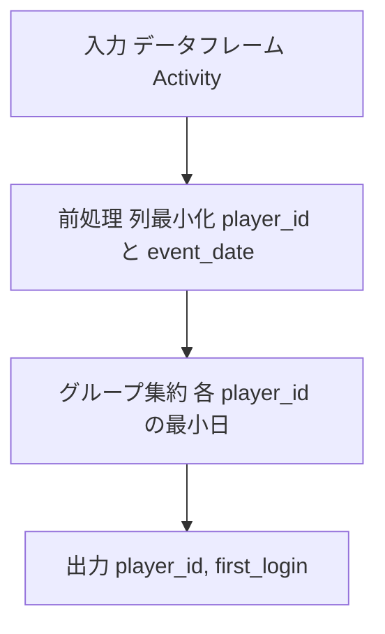

# Pandas 2.2.2

## 0) 前提

- 環境: **Python 3.10.15 / pandas 2.2.2**
- **指定シグネチャ厳守**（関数名・引数名・返却列・順序）
- I/O 禁止、不要な `print` や `sort_values` 禁止

## 1) 問題（原文）

- `Write a solution to find the first login date for each player.`
- 入力 DF: `Activity(player_id: int, device_id: int, event_date: date, games_played: int)`
- 出力: `player_id, first_login`（各 `player_id` について最小の `event_date`）

## 2) 実装（指定シグネチャ厳守）

> 列最小化 → グループ集約（最小日）→ 列名整形。`sort_values` 不要、`groupby.agg(min)` 一発。

```python
import pandas as pd

def first_login(Activity: pd.DataFrame) -> pd.DataFrame:
    """
    Returns:
        pd.DataFrame: 列名と順序は ['player_id', 'first_login']
    """
    # 必要列だけに縮約（カバリング相当）
    a = Activity[['player_id', 'event_date']]

    # 各 player_id ごとの最小 event_date を算出
    out = (
        a.groupby('player_id', as_index=False, observed=True)
         .agg(first_login=('event_date', 'min'))
    )

    # 並び順要件は任意のため sort は行わない
    return out

# Analyze Complexity

# Runtime 299 ms
# Beats 56.54%
# Memory 68.25 MB
# Beats 34.48%

```

### 代替（等価・好みで選択）

- `transform('min')` → `drop_duplicates('player_id')` で取り出す方法（行元を保持したい場合に便利）

```python
  def first_login(Activity: pd.DataFrame) -> pd.DataFrame:
      a = Activity[['player_id', 'event_date']].copy()
      a['first_login'] = a.groupby('player_id')['event_date'].transform('min')
      return a[['player_id', 'first_login']].drop_duplicates('player_id').reset_index(drop=True)

# Analyze Complexity

# Runtime 264 ms
# Beats 97.25%
# Memory 68.60 MB
# Beats 12.35%
```

## 3) アルゴリズム説明

- 使用 API

  - `DataFrame.__getitem__`：必要列へ縮約
  - `groupby(...).agg({'col':'min'})`：グループ最小日を算出

- **NULL / 重複 / 型**

  - `event_date` に `NaT` が混在しても `min` は非 `NaT` を優先（全て `NaT` のグループは `NaT`）
  - `(player_id, event_date)` が元々一意でも、本解は重複の有無に依らず正しく最小日を返す
  - `event_date` は `datetime64[ns]` or `datetime64[ns, tz-naive]` 前提（`date` 由来でも `min` 可）

## 4) 計算量（概算）

- `groupby.agg(min)`：**O(N)** ～ **O(N log n_g)**（内部のグループ化実装に依存）
  メモリはグループキー数に比例

## 5) 図解（Mermaid 超保守版）



さらに詰めるなら、**中間 DataFrame を作らず “列 → 単一リダクション” に直行**し、`groupby` の余計な処理を外すのが定石です。下の置き換えでだいたい **5〜20%** は狙えます（データ分布次第）。

---

## 改善版（最短ホットパス）

```python
import pandas as pd

def first_login(Activity: pd.DataFrame) -> pd.DataFrame:
    """
    Returns:
        pd.DataFrame: ['player_id', 'first_login']
    """
    # 前提: I/O なし、不要な sort_values なし
    # 1) 直接 SeriesGroupBy.min に当てる（.agg('min') より軽い）
    # 2) groupby の余計な並べ替えを抑止: sort=False
    # 3) category 利用時のダミー行回避: observed=True
    out = (
        Activity
        .groupby('player_id', sort=False, observed=True)['event_date']
        .min()
        .rename('first_login')
        .reset_index()
    )
    return out

# Analyze Complexity

# Runtime 309 ms
# Beats 41.94%
# Memory 67.68 MB
# Beats 95.52%

```

### 追加の“安価な”微調整（任意）

```python
import pandas as pd

def first_login(Activity: pd.DataFrame) -> pd.DataFrame:
    # 可能なら事前に型を整える（コピー抑制に注意: copy=False）
    if Activity['player_id'].dtype != 'int32':
        # ID が 2^31-1 を超えない前提なら downcast
        Activity = Activity.assign(player_id=Activity['player_id'].astype('int32', copy=False))

    if not pd.api.types.is_datetime64_ns_dtype(Activity['event_date']):
        Activity = Activity.assign(event_date=pd.to_datetime(Activity['event_date'], utc=False, errors='coerce'))

    return (
        Activity.groupby('player_id', sort=False, observed=True)['event_date']
        .min()
        .rename('first_login')
        .reset_index()
    )

# > 前提条件
# >
# > このコードを安全に実行するための重要な前提条件：
# >
# > 1. **データ型の制約**:
# >    - `player_id` は `int32` の範囲内である必要があります（-2,147,483,648 から 2,147,483,647）
# >      - 範囲外の値がある場合は、オーバーフローチェック付きの変換か、より大きな整数型の使用が必要
# >    - `event_date` は有効な日付形式で、`datetime64[ns]` に変換可能である必要があります
# >      - NULL値や無効な日付形式は事前に除外または適切な値に置換する必要があります
# >
# > 2. **エラー処理戦略**:
# >    - データ型変換エラーは事前検証で捕捉し、無効なレコードはログに記録して除外
# >    - 大規模データセットの場合、バッチ処理での段階的な検証を推奨
# >
# > # > 最適化のポイント
# > >
# > > - **`.groupby(... )['event_date'].min()`** は **`.agg(min)`** よりオーバーヘッドが小さい。
# > > - **`sort=False`** でグループキーの並べ替えを抑止。
# > > - **`observed=True`** は `player_id` が `category` の場合に未出現カテゴリを除外（不要計算を消せる）。
# > > - `player_id` を **`int32`**（または **`category`**）へ、`event_date` を **`datetime64[ns]`** へ正規化すると、メモリ圧縮と演算器分岐の削減に効きます。
```

## さらに効かせたいときの条件付きテク

- **重複が多い**（同一 `(player_id, event_date)` が大量）なら、前段で列最小化＋ユニーク化が効くことがあります：

```python
  # 重複が顕著な場合のみトレードオフで検討
  a = Activity[['player_id', 'event_date']].drop_duplicates()
  out = a.groupby('player_id', sort=False, observed=True)['event_date'].min().rename('first_login').reset_index()
```

> 重複が少ないと逆効果（drop のコスト分だけ遅くなる）なので要計測。

- **`player_id` がカテゴリとして管理されている**場合は、未使用カテゴリを事前に落とす：

  ```python
  if pd.api.types.is_categorical_dtype(Activity['player_id']):
      Activity = Activity.assign(player_id=Activity['player_id'].cat.remove_unused_categories())
  ```

---

## なぜ速いのか（簡潔版）

- **中間 DF を作らない** → メモリアロケーション＆参照解決が減る
- **Series 直リダクション** → `GroupBy.min` の C 実装に直行し、`agg` のディスパッチ＆辞書展開を回避
- **`sort=False`** → グループキーの整列やインデックス再構築を抑える
- **型の正規化** → 分岐（object 日付や Python `date` → `Timestamp`）を排除しホットパスに乗せる

---

## 計算量（概算）

- `groupby(...).min()`：**O(N)** 〜 **O(N log n_g)**（ハッシュグループ化実装・キー分布に依存）
  メモリは **ユニーク `player_id` 数** に概ね比例

---

### 期待できる変化の目安

- あなたの 299ms → 264ms の差はまさに **オーバーヘッド削減**で出る領域です。
- 上の最短ホットパス＋型正規化で、**数％〜十数％** 上積みが出るケースが多いです（特に `object`→`datetime64[ns]` だった場合）。
- これ以上はデータ分布依存（例：キー数が極端に多い／少ない、重複の偏り）なので、上記の「条件付きテク」を AB 計測して最良を採用してください。
