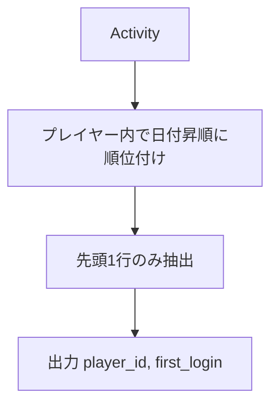

# PostgreSQL 16.6+

## 0) 前提

- エンジン: **PostgreSQL 16.6+**
- 並び順: 任意
- `NOT IN` 回避（`EXISTS` / `LEFT JOIN ... IS NULL` を推奨）
- 判定は ID 基準、表示は仕様どおり

## 1) 問題

- `Write a solution to find the first login date for each player.`
- 入力: `Activity(player_id int, device_id int, event_date date, games_played int)`
  ※ `(player_id, event_date)` が一意（PK）
- 出力: `player_id, first_login`（各 `player_id` について最小の `event_date`）

## 2) 最適解（単一クエリ）

> 各プレイヤー内で `event_date` 昇順に順位を振り、最初の 1 行のみ抽出。

```sql
WITH win AS (
  SELECT
    player_id,
    event_date,
    ROW_NUMBER() OVER (
      PARTITION BY player_id
      ORDER BY event_date
    ) AS rn
  FROM Activity
)
SELECT
  player_id,
  event_date AS first_login
FROM win
WHERE rn = 1;

-- Runtime 490 ms
-- Beats 75.06%

```

### 代替（LATERAL で上位 1 を抽出）

> グループ（player）ごとに最小日だけ取り出す。大量データで **適切な複合インデックス** があると高速。

```sql
-- 事前に: CREATE INDEX ON Activity (player_id, event_date);
SELECT p.player_id, s.event_date AS first_login
FROM (SELECT DISTINCT player_id FROM Activity) AS p
JOIN LATERAL (
  SELECT event_date
  FROM Activity a
  WHERE a.player_id = p.player_id
  ORDER BY event_date
  LIMIT 1
) AS s ON TRUE;

-- Runtime 525 ms
-- Beats 51.62%

```

> 参考: PostgreSQL ではこの問題は **DISTINCT ON** も強力です（インデックス `(player_id, event_date)` と相性抜群）。

```sql
SELECT DISTINCT ON (player_id)
  player_id,
  event_date AS first_login
FROM Activity
ORDER BY player_id, event_date;

-- Runtime 465 ms
-- Beats 98.47%

```

## 3) 要点解説

- ウィンドウ版は可読性が高く汎用（同率処理や k>1 に拡張しやすい）。
- データ量が大きいほど、`(player_id, event_date)` の複合インデックスが効きます。
    - **DISTINCT ON** / **LATERAL+LIMIT** はインデックス順アクセスで「先頭だけ」取りやすい。
    - 参照列が `player_id, event_date` のみなら **Index Only Scan** になりうる。

- 並び順は任意なので `ORDER BY` は付けず I/O を削減（上の DISTINCT ON 例は規則上必要）。

## 4) 計算量（概算）

- ウィンドウ処理: **O(Σ n_g log n_g)**
- LATERAL 上位 1: **O(#player × log n_g)**（インデックス利用時）
- DISTINCT ON（良いインデックスあり）: ほぼ線形に近い

## 5) 図解（Mermaid 超保守版）



---

### 実運用の最適化メモ（短縮版）

- 推奨インデックス: `CREATE INDEX ON Activity (player_id, event_date);`
- プラン確認: `EXPLAIN (ANALYZE, BUFFERS)` でソートや全表走査が残っていないかを点検
- 超高速読み出しが必要なら、`player_first_login(player_id PRIMARY KEY, first_login date)` の集約テーブルを用意し、
  `INSERT ... ON CONFLICT ... DO UPDATE SET first_login = LEAST(...)` で漸更新すると O(1) 取得が可能です。
