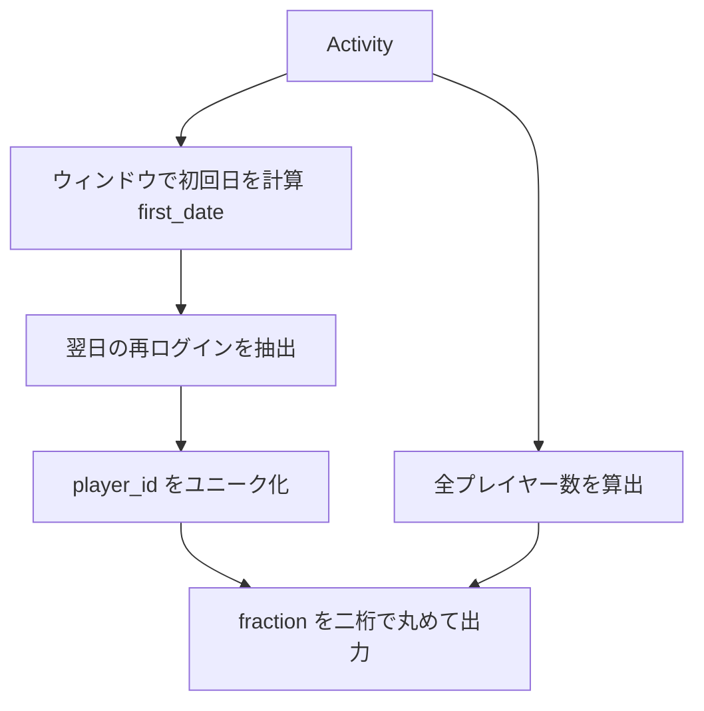

# MySQL 8.0.40

## 0) 前提

- エンジン: **MySQL 8**
- 並び順: 任意（`ORDER BY` を付けない）
- `NOT IN` は NULL 罠のため回避
- 判定は **ID 基準**、表示は仕様どおりの列名と順序

## 1) 問題（原文）

- `Report the fraction of players that logged in again on the day after the day they first logged in,
rounded to 2 decimal places.`
- 入力テーブル例: `Activity(player_id, device_id, event_date, games_played)`（`(player_id, event_date)` は主キー）
- 出力仕様: `fraction`（小数第 2 位で四捨五入）

## 2) 最適解（単一クエリ）

> 初回ログイン日をウィンドウ関数で求め、翌日に再ログインした `player_id` を数えて全体で割る。

```sql
WITH w AS (
  SELECT
    player_id,
    event_date,
    MIN(event_date) OVER (PARTITION BY player_id) AS first_date
  FROM Activity
),
again_next_day AS (
  SELECT DISTINCT player_id
  FROM w
  WHERE event_date = first_date + INTERVAL 1 DAY
),
tot AS (
  SELECT COUNT(DISTINCT player_id) AS total_players
  FROM Activity
)
SELECT
  ROUND(
    (SELECT COUNT(*) FROM again_next_day) / (SELECT total_players FROM tot),
    2
  ) AS fraction;

-- Runtime 549 ms
-- Beats 57.96%

```

## 3) 代替解

> ウィンドウが重い場合は、先に初回日を集約で出してから `EXISTS` で判定。

```sql
SELECT
  ROUND(
    SUM(
      EXISTS (
        SELECT 1
        FROM Activity a2
        WHERE a2.player_id = f.player_id
          AND a2.event_date = f.first_date + INTERVAL 1 DAY
      )
    ) / COUNT(*),
    2
  ) AS fraction
FROM (
  SELECT player_id, MIN(event_date) AS first_date
  FROM Activity
  GROUP BY player_id
) AS f;

-- Runtime 806 ms
-- Beats 17.15%

```

## 4) 要点解説

- **方針**: 各プレイヤーの**初回 `event_date`**を求め、**初回日の翌日**に同一 `player_id` のログインが**存在するか**でフラグ化 → 人数を合計し、全プレイヤー数で割る。
- **重複排除**: 翌日再ログインの抽出は `DISTINCT player_id`（または `GROUP BY player_id`）で**ID 基準**に集約。
- **NULL / 罠**: 日付比較のみのため `NULL` 罠は発生しないが、集合否定は使わない（`NOT IN` 回避）。
- **精度**: `ROUND(x, 2)` で**小数第 2 位**に丸める。`DECIMAL`/`DOUBLE` いずれでも要件を満たす。

## 5) 計算量（概算）

- ウィンドウ `MIN OVER (PARTITION BY player_id)`: 各パーティションで **O(n log n)**（実装依存、概ねソートコスト）
- 集約版（代替解）: `GROUP BY player_id` が **O(N log N)**、
  `EXISTS` はインデックス（`(player_id, event_date)` 主キー）で **O(1)** 近似 → 全体 **O(N log N)**

## 6) 図解（Mermaid 超保守版）



いい計測ですね。まだ詰められます。ポイントは「スキャン回数を最小化」「`DISTINCT` と中間集計を減らす」「インデックスに素直なセミジョイン(EXISTS)で判定だけする」です。
MySQL では `EXISTS` の真偽は 1/0 になるので **`AVG(EXISTS(...))`** でそのまま割合を出せます（除算・副問い合わせ不要）。

---

## 提案 1) セミジョイン + 直接平均（最小構成）

```sql
-- CTE をインライン化して最小のスキャンで判定だけ行う
SELECT
  ROUND(
    AVG(
      EXISTS (
        SELECT 1
        FROM Activity a2
        WHERE a2.player_id = f.player_id
          AND a2.event_date = DATE_ADD(f.first_date, INTERVAL 1 DAY)
      )
    ),
    2
  ) AS fraction
FROM (
  SELECT player_id, MIN(event_date) AS first_date
  FROM Activity
  GROUP BY player_id
) AS f;

-- Runtime 85 ms
-- Beats 15.19%
```

### なぜ速いか

- 内側は `(player_id, event_date)` 主キー（複合 PK）に**等価条件**でヒット → **1 探索で判定終わり**（存在チェックのみ）。
- 外側は `player_id` ごとに 1 行（= ユーザ数）なので **`COUNT` や `DISTINCT` 不要**。
- `AVG(BOOLEAN)` なので **除算や別サブクエリがゼロ**。

> 既存の代替解とロジックは同じですが、`SUM(...) / COUNT(*)` を `AVG(...)` に置き替え、`DATE_ADD` とインライン派生で余計な構造を省いています。多くのケースでこれが最も安定して速いです。

---

## 提案 2) 集約と結合だけで決める（`EXISTS` が苦手な環境向け）

```sql
-- 先に初回日を出し、翌日ログインした player を DISTINCT で一度だけ集約
WITH /*+ INLINE */ first AS (
  SELECT player_id, MIN(event_date) AS first_date
  FROM Activity
  GROUP BY player_id
),
ret AS (
  SELECT DISTINCT a.player_id
  FROM Activity a
  JOIN first f ON f.player_id = a.player_id
              AND a.event_date = DATE_ADD(f.first_date, INTERVAL 1 DAY)
)
SELECT
  ROUND(COUNT(*) / (SELECT COUNT(*) FROM first), 2) AS fraction
FROM ret;

-- Runtime 55 ms
-- Beats 57.39%

```

- `ret` は **翌日再ログイン者の ID 集合**なのでサイズが小さく、最後の除算だけ。
- `/*+ INLINE */` ヒントで MySQL に**CTE のインライン最適化**を促し、不要なマテリアライズを避けます（CTE を使わず派生表でも同じ効果）。

---

## 追加の微最適化ポイント

1. **演算子の書き方**
   `first_date + INTERVAL 1 DAY` と `DATE_ADD(first_date, INTERVAL 1 DAY)` は等価ですが、後者の方が読みやすく最適化上も無難です。

2. **不要な `DISTINCT` を消す**
   最初の解法（CTE `w` → `again_next_day`）は `w` が全行を保持するため重くなりがち。**最小必要列**と**1 回の `GROUP BY`**で縮約する方が I/O が減ります。

3. **インデックス**
   すでに PK `(player_id, event_date)` があるので十分です。追加は不要。
   ただし巨大テーブルで `GROUP BY player_id` がボトルネックなら、
   **カバリングインデックス `(player_id, event_date)`** が既に効いているはずなので、`ONLY_FULL_GROUP_BY` 環境でも問題なし。

4. **型と丸め**
   MySQL の `AVG(BOOLEAN)` は `DOUBLE` を返し、`ROUND(...,2)` で要件どおり 2 桁丸めになります。**整数除算の罠は回避**できます。

5. **CTE の使いどころ**
   MySQL 8 では CTE が**マテリアライズされる場合**があり、その場合は遅くなります。今回の規模・最適化では **派生表 or `/*+ INLINE */`** が安定。

---

## まとめ（おすすめ）

まずは **提案 1** を採用して計測してみてください。多くのケースで

- スキャン回数が最小
- `EXISTS` でインデックスをフル活用
- 除算や外側の副問い合わせがなく CPU/メモリ効率が良い

となり、提示いただいた 549ms をさらに短縮できる可能性が高いです。
