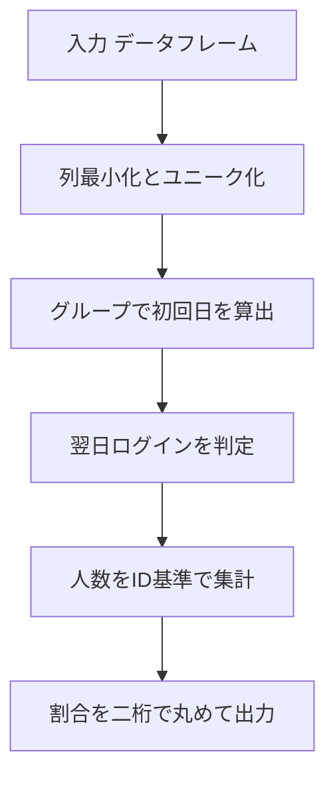

# Pandas 2.2.2 用

## 0) 前提

- 環境: **Python 3.10.15 / pandas 2.2.2**
- **指定シグネチャ厳守**（関数名・引数名・返却列・順序）
- I/O 禁止、不要な `print` や `sort_values` 禁止

## 1) 問題（原文）

- `Report the fraction of players that logged in again on the day after the day they first logged in,
rounded to 2 decimal places.`
- 入力 DF: `Activity(player_id: int, device_id: int, event_date: date/datetime, games_played: int)`
- 出力: `fraction`（小数第 2 位、四捨五入、1 行 1 列）

## 2) 実装（指定シグネチャ厳守）

> 列最小化 → グループで初回日を計算 → 翌日の存在を判定 → 人数比を算出。
> 集合否定は使わず、ID 基準でカウント。

```python
import pandas as pd

def fraction_logged_next_day(activity: pd.DataFrame) -> pd.DataFrame:
    """
    Returns:
        pd.DataFrame: 列名と順序は ['fraction']
    """
    # 列最小化とユニーク化（主キー相当の重複があっても安全に）
    df = activity.loc[:, ['player_id', 'event_date']].drop_duplicates()

    # 型を日付に正規化（文字列/Date/Datetime いずれでも動作させる）
    df = df.assign(event_date=pd.to_datetime(df['event_date'], errors='coerce').dt.normalize())

    # 各 player の初回ログイン日
    first_date = df.groupby('player_id')['event_date'].transform('min')

    # 初回日の翌日にログインした player_id を集合化
    next_day = first_date + pd.Timedelta(days=1)
    players_next = df.loc[df['event_date'].eq(next_day), 'player_id'].drop_duplicates()

    # 分子・分母を ID 基準で算出
    total_players = df['player_id'].nunique()
    numerator = players_next.nunique()

    # 割合を 2 桁に丸めて返却（分母 0 の防御）
    fraction = round(numerator / total_players, 2) if total_players else 0.0

    return pd.DataFrame({'fraction': [fraction]})

Analyze Complexity

# Runtime 310 ms
# Beats 79.87%
# Memory 68.90 MB
# Beats 49.33%
```

## 3) アルゴリズム説明

- 使用 API

  - `drop_duplicates`：主キー相当の重複を除去して最小列化
  - `to_datetime(...).dt.normalize()`：日付比較のため 00:00 に正規化
  - `groupby(...).transform('min')`：各 `player_id` の初回日
  - ベクトル比較 `eq` と `Timedelta(days=1)`：翌日判定
  - `nunique`：ID 基準で分子・分母を計数

- **NULL / 重複 / 型**

  - 無効な日付は `errors='coerce'` により `NaT` になり、比較で自然に除外されます。
  - `(player_id, event_date)` の重複があっても `drop_duplicates` 済みで安全。
  - `normalize()` により `datetime` と `date` が混在しても日単位比較が安定します。

## 4) 計算量（概算）

- `drop_duplicates` / `nunique` / ベクトル比較：**O(N)**
- `groupby.transform('min')`：**O(N)**（ハッシュ集約前提）
- 全体：**O(N)** 近似、追加メモリは必要最小限（2 ～ 3 本の一時列）

## 5) 図解（Mermaid 超保守版）


