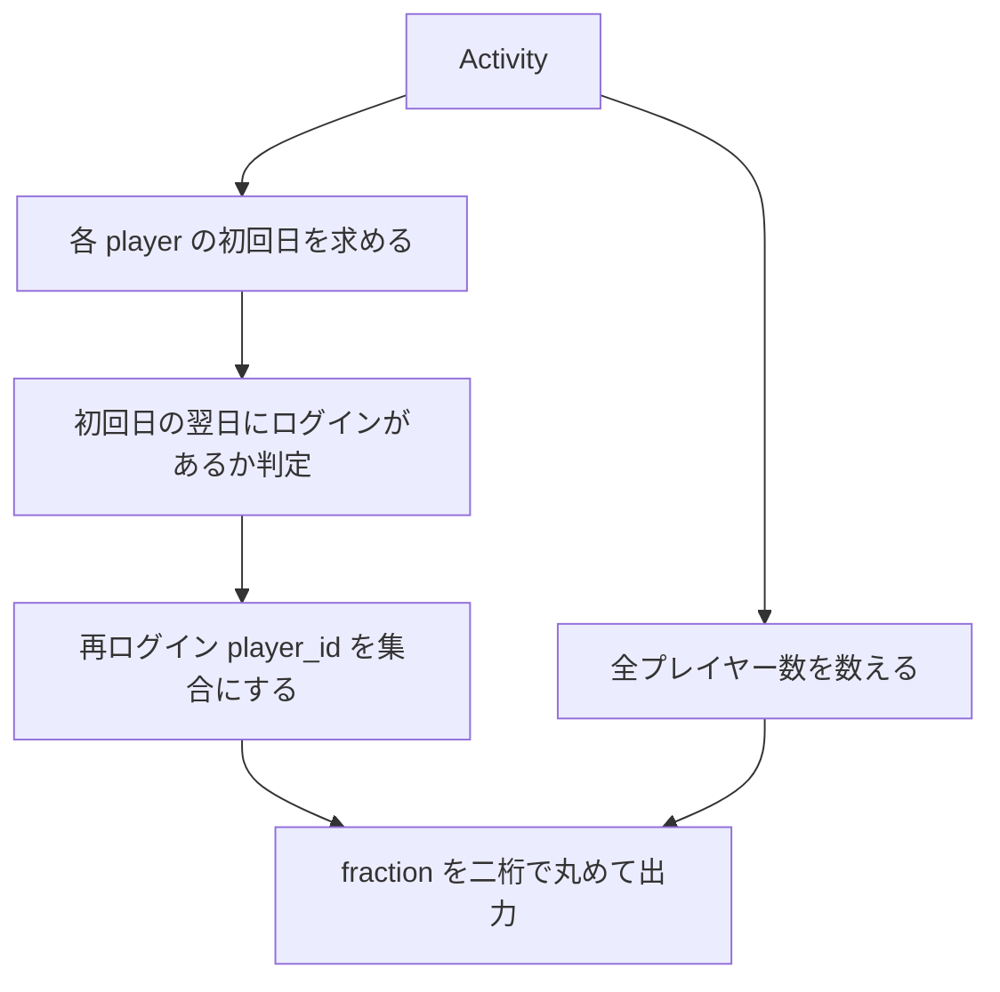

# PostgreSQL 16.6+

## 0) 前提

- エンジン: **PostgreSQL 16.6+**
- 並び順: 任意
- `NOT IN` 回避（`EXISTS` / `LEFT JOIN ... IS NULL` を推奨）
- 判定は ID 基準、表示は仕様どおり

## 1) 問題

- `Report the fraction of players that logged in again on the day after the day they first logged in,
rounded to 2 decimal places.`
- 入力: `Activity(player_id int, device_id int, event_date date, games_played int)`
  （複合主キー `(player_id, event_date)`）
- 出力: `fraction`（小数第 2 位で四捨五入）

## 2) 最適解（単一クエリ）

> **初回ログイン日**をウィンドウで求め、**翌日**にログインのあった `player_id` を抽出して全体で割る。
> 集約とキャストで **整数除算の罠**を回避します。

```sql
WITH w AS (
  SELECT
    player_id,
    event_date,
    MIN(event_date) OVER (PARTITION BY player_id) AS first_date
  FROM Activity
),
again_next_day AS (
  SELECT DISTINCT player_id
  FROM w
  WHERE event_date = first_date + INTERVAL '1 day'
),
tot AS (
  SELECT COUNT(DISTINCT player_id) AS total_players
  FROM Activity
)
SELECT
  ROUND(
    (SELECT COUNT(*) FROM again_next_day)::numeric
    / (SELECT total_players FROM tot)::numeric,
    2
  ) AS fraction;

-- Runtime 467 ms
-- Beats 97.63%

```

### 代替（EXISTS × 集約ベースの最小構成：高速・明快）

> ウィンドウ不要。**各プレイヤーの初回日**を一度求め、**翌日の存在チェック**を `EXISTS` で実施。
> `AVG((EXISTS ... )::int)` でそのまま割合にできます（`true=1/false=0`）。

```sql
SELECT
  ROUND(
    AVG(
      (
        EXISTS (
          SELECT 1
          FROM Activity a2
          WHERE a2.player_id = f.player_id
            AND a2.event_date = f.first_date + INTERVAL '1 day'
        )
      )::int
    )::numeric,
    2
  ) AS fraction
FROM (
  SELECT player_id, MIN(event_date) AS first_date
  FROM Activity
  GROUP BY player_id
) AS f;

-- Runtime 537 ms
-- Beats 46.68%

```

> 補足: `(player_id, event_date)` が主キーなので、`EXISTS` は**1 回のインデックス探索**で判定が終わります。

## 3) 要点解説

- **方針**: 「初回日 → 翌日ログインの有無（ID 単位）」をフラグ化し、人数比を出す。
- **ウィンドウ vs 集約**: PostgreSQL ではどちらも高速。I/O を減らしたいなら **集約＋ EXISTS** が素直。
- **数値型**: 除算前に `::numeric` へキャスト、または `AVG((EXISTS)::int)` を使うと精度・可読性ともに良好。
- **`DISTINCT` の最小化**: 翌日再ログイン者は **ID 集合**なので `again_next_day` で `DISTINCT player_id` のみ。

## 4) 計算量（概算）

- ウィンドウ案: **O(Σ n_g log n_g)**（`MIN OVER (PARTITION BY player_id)` のソート前提）
- 集約＋ EXISTS 案: `GROUP BY player_id` が **O(N log N)**、内側 `EXISTS` は主キーで **O(1)** 近似 → 実効 **O(N log N)**

## 5) 図解（Mermaid 超保守版）


