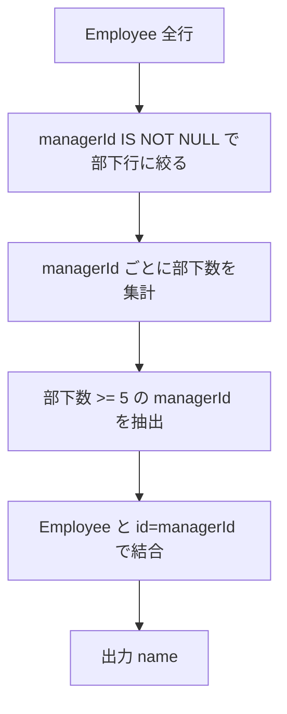

# MySQL 8.0.40

## 0) 前提

- エンジン: **MySQL 8**
- 並び順: 任意（`ORDER BY` を付けない）
- `NOT IN` は NULL 罠のため回避
- 判定は **ID 基準**、表示は仕様どおりの列名と順序

## 1) 問題

- `Find managers with at least five direct reports.`

- 入力テーブル例:

  **Employee**

  | column     | type    | note                           |
  | ---------- | ------- | ------------------------------ |
  | id         | int     | PK                             |
  | name       | varchar | 従業員名                       |
  | department | varchar | 部署                           |
  | managerId  | int     | 直属上長の id（NULL なら無し） |

- 出力仕様:

  - 列: `name`（**直属部下が 5 人以上いる**マネージャの名前）
  - 順序は任意

## 2) 最適解（単一クエリ）

> 直属部下数を **ウィンドウ集計**で数え、5 人以上の `managerId` を一意化してから、**ID で従業員表に結合**して名前を出す。

```sql
WITH win AS (
  SELECT
    managerId,
    COUNT(*) OVER (PARTITION BY managerId) AS direct_cnt
  FROM Employee
  WHERE managerId IS NOT NULL
),
mgr AS (
  SELECT DISTINCT managerId
  FROM win
  WHERE direct_cnt >= 5
)
SELECT e.name
FROM mgr
JOIN Employee AS e
  ON e.id = mgr.managerId;

-- Runtime 336 ms
-- Beats 56.71%

```

- ポイント

  - `COUNT(*) OVER (PARTITION BY managerId)` で **直属部下数**を算出
  - `DISTINCT` で `managerId` をユニーク化（重複行を抑止）
  - 最後は **ID 結合**で氏名を取得
  - `ORDER BY` なし（任意順）

## 3) 代替解

> シンプルな `GROUP BY ... HAVING`。ウィンドウ不要で高速なことが多い。

```sql
SELECT e.name
FROM Employee AS e
JOIN (
  SELECT managerId
  FROM Employee
  WHERE managerId IS NOT NULL
  GROUP BY managerId
  HAVING COUNT(*) >= 5
) AS g
  ON e.id = g.managerId;

-- Runtime 296 ms
-- Beats 97.89%

```

> もう一案（`EXISTS`）— `NOT IN` は使わず、相関はシンプルに：

```sql
SELECT e.name
FROM Employee AS e
WHERE EXISTS (
  SELECT 1
  FROM Employee AS r
  WHERE r.managerId = e.id
  GROUP BY r.managerId
  HAVING COUNT(*) >= 5
);

-- Runtime2096 ms
-- Beats 5.00%

```

## 4) 要点解説

- **方針**: 「部下側の行」を起点に `managerId` ごとに集計 → **マネージャ ID** を抽出 → **ID で名前へ解決**。
- **NULL/重複**:

  - `managerId IS NOT NULL` で部下行のみ対象。
  - ウィンドウ版は `DISTINCT` で一意化してから結合。

- **安定性**: 順序指定不要なので `ORDER BY` を付けない方が速い。
- **拡張**: 「最低人数」を可変にするなら `HAVING COUNT(*) >= ?` や CTE でパラメータ化。

## 5) 計算量（概算）

- ウィンドウ法: パーティションごとに **O(n log n)** 近辺（実装依存、`managerId` インデックスで実効は軽め）
- `GROUP BY` 法: **O(N)**〜**O(N log N)**（`managerId` にインデックスがあれば有利）
- 結合: `Employee(id)` PK で **O(N)** 近似

## 6) 図解（Mermaid 超保守版）


