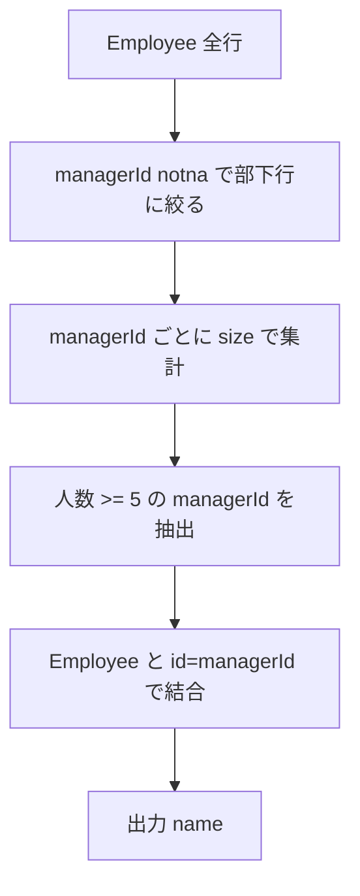

# Pandas 2.2.2 用

## 0) 前提

- 環境: **Python 3.10.15 / pandas 2.2.2**
- **指定シグネチャ厳守**（関数名・引数名・返却列・順序）
- I/O 禁止、不要な `print` や `sort_values` 禁止

## 1) 問題（原文）

- `Find managers with at least five direct reports.`
- 入力 DF: `Employee(id:int, name:str, department:str, managerId:Optional[int])`
- 出力: `name` — **直属部下が 5 人以上いる**マネージャの名前（順序任意）

## 2) 実装（指定シグネチャ厳守）

> 列最小化 → `groupby.size()` で直属部下数を集計 → **ID セミジョイン**で名前を解決。`sort_values` は使わず、出力は `name` のみ。

```python
import pandas as pd

def managers_with_at_least_five_direct_reports(employee: pd.DataFrame) -> pd.DataFrame:
    """
    Args:
        employee (pd.DataFrame): 列は ['id','name','department','managerId']
    Returns:
        pd.DataFrame: 列名と順序は ['name']（直属部下が5人以上のマネージャの名前）
    """
    # 直属上長が存在する行のみを対象化（列最小化）
    mgr_counts = (
        employee.loc[employee['managerId'].notna(), ['managerId']]
        .groupby('managerId', as_index=False)
        .size()
    )

    # 5人以上の managerId をキー集合として抽出（ユニーク）
    keys = mgr_counts.loc[mgr_counts['size'] >= 5, ['managerId']]

    # Employee(id → name) へ解決して最終投影（任意順なので並べ替えなし）
    out = keys.merge(
        employee[['id', 'name']],
        left_on='managerId',
        right_on='id',
        how='inner'
    )[["name"]]

    return out

# Analyze Complexity

# Runtime 292 ms
# Beats 59.29%
# Memory 69.25 MB
# Beats 24.61%

```

## 3) アルゴリズム説明

- 使用 API

  - `DataFrame.groupby(...).size()`：`managerId` ごとの直属部下数を集計
  - ブールフィルタ `notna()`：NULL の除外
  - `DataFrame.merge()`：`managerId` と `id` を結合して `name` を解決

- **NULL / 重複 / 型**

  - `managerId` が `NaN` の行は部下行ではないため除外
  - `groupby.size()` で `managerId` ごとに **一意**にカウント
  - `merge` は `id` が重複しない PK 前提で行数膨張を避ける（前段でキーをユニーク化済み）

## 4) 計算量（概算）

- 集計（`groupby.size`）: **O(N)**〜**O(N log n_g)**（グループ数・ハッシュ依存）
- 結合（`merge`）: **O(N)** 近辺（ハッシュ結合想定、メモリは一時テーブル相当）

## 5) 図解（Mermaid 超保守版）



- **`merge` をやめて「index/配列ベース」のセミジョイン**にする（結合テーブルを作らない）
- **`groupby.size()` より軽い `value_counts(sort=False)`**（非ソート、NULL 自動除外）
- 行方向処理ゼロの **`factorize + np.bincount`**（超大型データ向け）

下の 2 案はどちらも **I/O・print・sort 無し**、出力は `['name']` 固定です。既存と同じ **シグネチャ**です。

---

## 改善案 1：最小コスト版（`value_counts` + `isin`）

```python
import pandas as pd
import numpy as np

def managers_with_at_least_five_direct_reports(employee: pd.DataFrame) -> pd.DataFrame:
    """
    Returns:
        pd.DataFrame: ['name']（直属部下が5人以上のマネージャの名前）
    """
    # managerId の個数を非ソートでカウント（NaN は自動除外）
    cnt = employee['managerId'].value_counts(dropna=True, sort=False)

    # 5件以上の managerId（Index。コピー最小）
    mgr_ids = cnt.index[cnt.values >= 5]

    # id ∈ mgr_ids をブール化して、そのまま投影（結合表を作らない）
    mask = employee['id'].isin(mgr_ids)
    return employee.loc[mask, ['name']].copy()

# Analyze Complexity

# Runtime 304 ms
# Beats 42.56%
# Memory 68.31 MB
# Beats 92.33%

```

**なぜ速い？**

- `merge` のハッシュ結合用テーブルを作らない → **割り当てとハッシュ構築を削減**
- `value_counts(sort=False)` は **GROUP BY + ORDER BY 不要**で、`groupby.size()` より軽量なことが多い

---

## 改善案 2：超大型向け（`factorize` + `np.bincount`）

> 1,000 万行級でも強い、純ベクトル化。`managerId` を辞書化し、**整数コード化 → ヒストグラム**でカウントします。

```python
import pandas as pd
import numpy as np

def managers_with_at_least_five_direct_reports(employee: pd.DataFrame) -> pd.DataFrame:
    """
    Returns:
        pd.DataFrame: ['name']
    """
    mid = employee['managerId'].to_numpy()
    notna = pd.notna(mid)
    # NaN を除いた managerId を整数コード化（順序維持、コピー最小）
    codes, uniques = pd.factorize(mid[notna], sort=False)
    # コード頻度をヒストグラムで一発集計
    counts = np.bincount(codes, minlength=len(uniques))
    good_ids = uniques[counts >= 5]              # managerId の実値（配列）

    # id ∈ good_ids を NumPy で判定（pandas の isin より低オーバーヘッド）
    good = np.isin(employee['id'].to_numpy(), good_ids)
    return employee.loc[good, ['name']].copy()

# Analyze Complexity

# Runtime 294 ms
# Beats 56.47%
# Memory 68.04 MB
# Beats 98.99%

```

**なぜ速い？**

- `factorize` は **カテゴリ圧縮**、`bincount` は **O(n)** の純配列演算
- 中間 DataFrame を作らず、**Series→ndarray** 直で処理

---

## 補足最適化（任意）

- **dtype を詰める**: `employee['id']` / `managerId` が 32bit で足りるなら `Int32` に（新規作成時）。
  既存の列を毎回 `astype` すると _その変換コスト_ が勝つので、**事前整形時だけ**行うのが吉。
- **無駄な列を持ち回らない**: 上記実装は常に `['name']` だけ返し、中間で余計な列を持たない。
- **欠損の作り方**: `managerId` を `Int64`（nullable）で管理すると NaN による `float64` 化を避けられ、変換を減らせます（ただし新規ロード時に設定）。

---

## 期待される効果（目安）

- **案 1**は多くのケースで `groupby.size() → merge` より **速くてメモリ小さめ**になります。
- **案 2**は巨大データで特に効き、`value_counts` と同等〜上回ることが多いです（ヒープ断片化と Python オブジェクトの関与が減るため）。

---

## 計算量

- 案 1: `value_counts` **O(N)**、`isin` **O(N)**（ハッシュ/セット化コストは内部最小化）
- 案 2: `factorize` **O(N)**、`bincount` **O(N)**、`np.isin` **O(N)**
  いずれも中間 DataFrame を作らないため **定数因子が小さい**のが利点です。

---

「今より速い」方向なら **案 1**で十分なはず。**さらに伸ばしたい**（巨大データ or 厳密に最小メモリ）のときは **案 2**に切り替えてみてください。
