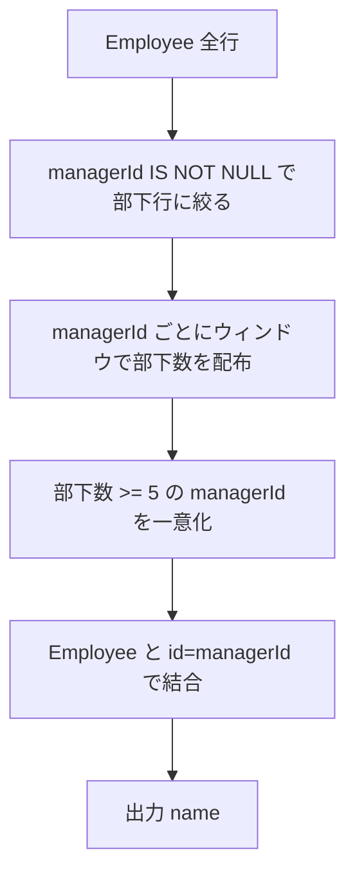

# PostgreSQL 16.6+

## 0) 前提

- エンジン: **PostgreSQL 16.6+**
- 並び順: 任意
- `NOT IN` 回避（`EXISTS` / `LEFT JOIN ... IS NULL` を推奨）
- 判定は ID 基準、表示は仕様どおり

## 1) 問題

- `Find managers with at least five direct reports.`

- 入力:

  **Employee**

  | column     | type    | note                           |
  | ---------- | ------- | ------------------------------ |
  | id         | int     | PK                             |
  | name       | varchar | 従業員名                       |
  | department | varchar | 部署                           |
  | managerId  | int     | 直属上長の id（NULL なら無し） |

- 出力:

  - 列: `name`（**直属部下が 5 人以上いる**マネージャの名前）
  - 順序は任意

## 2) 最適解（単一クエリ）

> PostgreSQL では **CTE + ウィンドウ集計**で、部下行から `managerId` ごとの人数を数え、5 人以上のマネージャ ID を一意化してから **ID 結合**で氏名を解決します。

```sql
WITH pre AS (
  SELECT managerId
  FROM Employee
  WHERE managerId IS NOT NULL
),
win AS (
  SELECT
    managerId,
    COUNT(*) OVER (PARTITION BY managerId) AS direct_cnt
  FROM pre
)
SELECT e.name
FROM (
  SELECT DISTINCT managerId
  FROM win
  WHERE direct_cnt >= 5
) m
JOIN Employee AS e
  ON e.id = m.managerId;

-- Runtime 291 ms
-- Beats 76.22%

```

### 代替（LATERAL で上位 k を作る）

> 今回の課題では **LATERAL は不要**ですが、グループごとに少量を抜き出す場面では次のように使います（参考パターン）。

```sql
-- 参考: 各マネージャごとに直属部下の入社順 上位3名だけ取り出す、等
SELECT mgr.id AS manager_id, sub.id AS report_id, sub.name
FROM Employee AS mgr
JOIN LATERAL (
  SELECT r.id, r.name
  FROM Employee AS r
  WHERE r.managerId = mgr.id
  ORDER BY r.id  -- 例: 代わりに入社日など
  LIMIT 3
) AS sub ON TRUE
WHERE EXISTS (
  SELECT 1
  FROM Employee r2
  WHERE r2.managerId = mgr.id
  GROUP BY r2.managerId
  HAVING COUNT(*) >= 5
);
```

## 3) 要点解説

- **ウィンドウ集計** `COUNT(*) OVER (PARTITION BY managerId)` で、行を潰さずに「直属部下数」を同じ `managerId` に配布できるため、
  その後で `DISTINCT` により **マネージャ ID を一意化**してから名前解決できます。
- **NULL 対応**: `managerId IS NOT NULL` で部下行だけを対象化。`NOT IN` は NULL で壊れるため不使用。
- **表示は仕様どおり**: 判定は ID、最終出力は `name` のみ。順序は任意のため `ORDER BY` なしで良い。

> シンプル志向の代替（`GROUP BY ... HAVING`）も有効：

```sql
SELECT e.name
FROM Employee AS e
JOIN (
  SELECT managerId
  FROM Employee
  WHERE managerId IS NOT NULL
  GROUP BY managerId
  HAVING COUNT(*) >= 5
) AS g
  ON e.id = g.managerId;

-- Runtime 310 ms
-- Beats 50.67%

```

## 4) 計算量（概算）

- ウィンドウ処理: **O(Σ n_g log n_g)**（`managerId` での並び替えコストを含む。インデックスがあれば実効は軽め）
- `GROUP BY` 代替: **O(N)**～**O(N log N)**（`managerId` に索引があると有利）
- 結合（`Employee(id)` PK）: **O(N)** 近似

## 5) 図解（Mermaid 超保守版）


