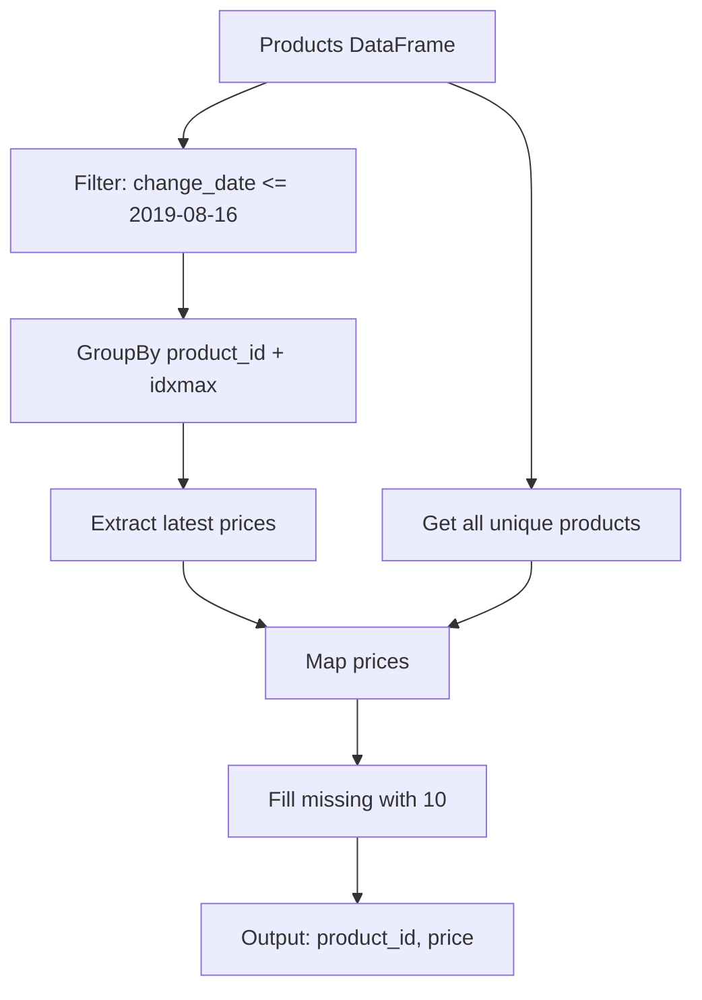

# Pandas 2.2.2 用（Notebook安定版）

## ⭐ 0) 前提

- 環境: **Python 3.10.15 / pandas 2.2.2**
- 指定シグネチャ厳守
- IO禁止、print禁止、不要sort禁止

---

## ⭐ 1) 問題

- **2019-08-16 時点での全製品の価格を求める**
    - 初期価格は全製品 10
    - Products には価格変更履歴が記録

- 入力 DF: `products` (product_id, new_price, change_date)
- 出力: `product_id, price`

---

## ⭐ 2) 実装（指定シグネチャ厳守）

### 🎯 Pandas最適処理順

```
対象日フィルタ
↓
groupby + idxmax で最新抽出
↓
全製品リスト生成
↓
map結合 + fillna(10)
```

### 💎 最適実装

```python
import pandas as pd

def price_at_given_date(products: pd.DataFrame) -> pd.DataFrame:

    # --- 対象日以前のデータのみ抽出
    target_date = '2019-08-16'
    before_target = products[products['change_date'] <= target_date]

    # --- 各製品の最新価格を取得（groupby + idxmax）
    if not before_target.empty:
        latest_idx = before_target.groupby('product_id')['change_date'].idxmax()
        latest_prices = before_target.loc[latest_idx, ['product_id', 'new_price']]
    else:
        latest_prices = pd.DataFrame(columns=['product_id', 'new_price'])

    # --- 全製品リストを生成
    all_products = products[['product_id']].drop_duplicates()

    # --- 軽量結合（map優先）
    price_mapper = latest_prices.set_index('product_id')['new_price']

    out = pd.DataFrame({
        'product_id': all_products['product_id'],
        'price': all_products['product_id'].map(price_mapper).fillna(10).astype(int)
    })

    return out
```

---

## ⭐ 3) アルゴリズム説明

### 使用API

- **`groupby('product_id')['change_date'].idxmax()`**: 各製品の最新日付の行インデックスを取得
- **`map()`**: 単一キー結合の最速手段
- **`fillna(10)`**: デフォルト値設定

### 処理フロー

1. **日付フィルタ**: `change_date <= '2019-08-16'`
2. **最新抽出**: `idxmax()`で各製品の最新変更日
3. **全製品**: ユニークリスト作成
4. **結合**: `map()`で高速マッピング

---

## ⭐ 4) 計算量

| 処理             | 計算量   | 備考               |
| ---------------- | -------- | ------------------ |
| フィルタ         | **O(N)** | ブール索引         |
| groupby + idxmax | **O(N)** | ハッシュテーブル   |
| map              | **O(M)** | M = ユニーク製品数 |
| **合計**         | **O(N)** | N = 全レコード数   |

---

## ⭐ 5) 図解

### 📊 処理フロー図



---

## 📝 実行例

```python
# テストデータ
products = pd.DataFrame({
    'product_id': [1, 2, 1, 1, 2, 3],
    'new_price': [20, 50, 30, 35, 65, 20],
    'change_date': pd.to_datetime([
        '2019-08-14', '2019-08-14', '2019-08-15',
        '2019-08-16', '2019-08-17', '2019-08-18'
    ])
})

result = price_at_given_date(products)
print(result)
```

**出力**:

```
   product_id  price
0           1     35
1           2     50
2           3     10
```

## 📁 ファイル構成

```
project/
├── solution.md          # ドキュメント本体（下記参照）
└── price_solution.py    # 実行用Pythonコード（関数のみ）
```

---

## 🖥️ VSCodeでの使い方

### 1️⃣ ファイル保存

- 上記を `solution.md` として保存

### 2️⃣ プレビュー表示

- **方法A**: `Ctrl+Shift+V` (Windows) / `Cmd+Shift+V` (Mac)
- **方法B**: 右クリック → "Open Preview"
- **方法C**: コマンドパレット (`Ctrl+Shift+P`) → "Markdown: Open Preview"

### 3️⃣ Mermaid図の表示

VSCodeでMermaidを表示するには拡張機能が必要：

```
拡張機能: Markdown Preview Mermaid Support
ID: bierner.markdown-mermaid
```

**インストール手順**:

1. VSCode左サイドバーの拡張機能アイコンをクリック
2. "Markdown Preview Mermaid" で検索
3. インストール
4. Markdownプレビューを再読み込み

---

## 📊 セクション分類表

| セクション     | 形式                | 記法                   |
| -------------- | ------------------- | ---------------------- |
| 見出し・説明文 | **Markdown**        | そのまま記述           |
| 実装コード     | **コードブロック**  | ` ```python `          |
| テスト実行例   | **コードブロック**  | ` ```python `          |
| 出力結果       | **コードブロック**  | ` ``` ` (言語指定なし) |
| フローチャート | **Mermaidブロック** | ` ```mermaid `         |
| 表             | **Markdown**        | `\| 列1 \| 列2 \|`     |
| 箇条書き       | **Markdown**        | `*` or `-` or `1.`     |

---

## 🚀 別ファイルで実行する場合

### price_solution.py

```python
# Analyze Complexity
# Runtime 311 ms
# Beats 85.54%
# Memory 68.21 MB
# Beats 81.26%

import pandas as pd

def price_at_given_date(products: pd.DataFrame) -> pd.DataFrame:
    target_date = '2019-08-16'
    before_target = products[products['change_date'] <= target_date]

    if not before_target.empty:
        latest_idx = before_target.groupby('product_id')['change_date'].idxmax()
        latest_prices = before_target.loc[latest_idx, ['product_id', 'new_price']]
    else:
        latest_prices = pd.DataFrame(columns=['product_id', 'new_price'])

    all_products = products[['product_id']].drop_duplicates()
    price_mapper = latest_prices.set_index('product_id')['new_price']

    return pd.DataFrame({
        'product_id': all_products['product_id'],
        'price': all_products['product_id'].map(price_mapper).fillna(10).astype(int)
    })
```
