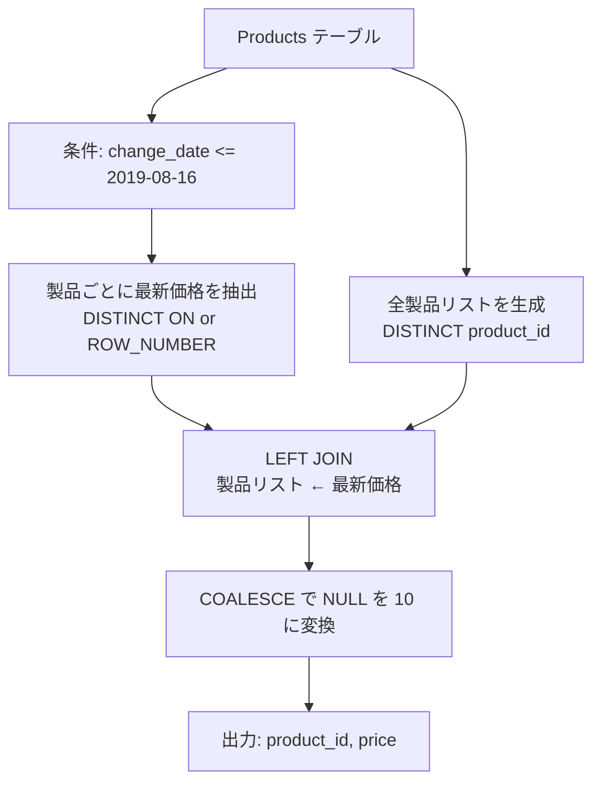

# PostgreSQL 16.6+

## 0) 前提

- エンジン: **PostgreSQL 16.6+**
- 並び順: 任意
- `NOT IN` 回避（`EXISTS` / `LEFT JOIN ... IS NULL` を推奨）
- 判定は ID 基準、表示は仕様どおり

## 1) 問題

- **2019-08-16 時点での全製品の価格を求める**
    - 初期価格は全製品 10
    - `Products` テーブルには価格変更履歴が記録されている
    - 対象日以前に価格変更があれば最新価格を、なければ初期価格 10 を返す
- 入力: `Products (product_id, new_price, change_date)`
- 出力: `product_id, price` ※ 2019-08-16 時点の価格

## 2) 最適解（単一クエリ）

> PostgreSQL の **`DISTINCT ON`** で各製品の最新価格を一発抽出。`COALESCE` でデフォルト価格をカバー。

```sql
WITH latest_prices AS (
  SELECT DISTINCT ON (product_id)
    product_id,
    new_price
  FROM Products
  WHERE change_date <= '2019-08-16'
  ORDER BY product_id, change_date DESC
),
all_products AS (
  SELECT DISTINCT product_id
  FROM Products
)
SELECT
  a.product_id,
  COALESCE(l.new_price, 10) AS price
FROM all_products a
LEFT JOIN latest_prices l
  ON a.product_id = l.product_id;
```

### 代替（CTE + ウィンドウ関数版）

```sql
WITH ranked_prices AS (
  SELECT
    product_id,
    new_price,
    ROW_NUMBER() OVER (
      PARTITION BY product_id
      ORDER BY change_date DESC
    ) AS rn
  FROM Products
  WHERE change_date <= '2019-08-16'
),
all_products AS (
  SELECT DISTINCT product_id
  FROM Products
)
SELECT
  a.product_id,
  COALESCE(r.new_price, 10) AS price
FROM all_products a
LEFT JOIN ranked_prices r
  ON a.product_id = r.product_id AND r.rn = 1;
```

### 最もコンパクトな実装

```sql
SELECT
  product_id,
  COALESCE(
    (SELECT new_price
     FROM Products p2
     WHERE p2.product_id = p1.product_id
       AND p2.change_date <= '2019-08-16'
     ORDER BY p2.change_date DESC
     LIMIT 1),
    10
  ) AS price
FROM (SELECT DISTINCT product_id FROM Products) p1;
```

## 3) 要点解説

- **`DISTINCT ON (product_id)`**: PostgreSQL 固有の強力な構文。各グループの先頭行のみを抽出
    - `ORDER BY product_id, change_date DESC` で製品ごとに最新日付順にソート
    - 各製品の最初の行（= 最新の価格変更）のみが残る

- **`LEFT JOIN` + `COALESCE`**:
    - 全製品リストと最新価格を外部結合
    - 価格変更履歴がない製品は `NULL` → `COALESCE` で 10 に変換

- **`WHERE change_date <= '2019-08-16'`**: 対象日以前の変更のみを考慮
    - この条件がないと未来の価格変更も含まれてしまう

- **ROW_NUMBER 版**: 標準 SQL で他 RDBMS にも移植しやすい
    - `rn = 1` で各製品の最新価格のみフィルタ

## 4) 計算量（概算）

- **`DISTINCT ON` 版**:
    - ソート: **O(n log n)** ※ n = 対象日以前のレコード数
    - 重複除去: **O(n)**
    - JOIN: **O(m)** ※ m = ユニーク製品数
    - 合計: **O(n log n)**

- **ウィンドウ関数版**:
    - ウィンドウ処理: **O(n log n)**
    - フィルタ + JOIN: **O(n + m)**
    - 合計: **O(n log n)**

- **スカラーサブクエリ版**:
    - 外側の製品数 m に対し、各製品で内部ソート
    - ワーストケース: **O(m × n/m × log(n/m)) ≈ O(n log n)**
    - インデックス `(product_id, change_date DESC)` があれば **O(m)** に近づく

## 5) 図解（Mermaid 超保守版）



**実行例の解説**:

- product_id = 1: 8/14→20, 8/15→30, **8/16→35** ✓
- product_id = 2: 8/14→50, (8/17→65 は対象外) → **50** ✓
- product_id = 3: (8/18→20 は対象外) → **デフォルト 10** ✓
