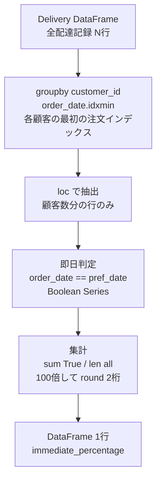

# Pandas 2.2.2用

## 0) 前提

- 環境: **Python 3.10.15 / pandas 2.2.2**
- **指定シグネチャ厳守**（関数名・引数名・返却列・順序）
- I/O 禁止、不要な `print` や `sort_values` 禁止

## 1) 問題

- **各顧客の最初の注文（order_dateが最も早い注文）における「即日配達」の割合を求める**
    - 即日配達(immediate): `order_date == customer_pref_delivery_date`
    - 予約配達(scheduled): `order_date < customer_pref_delivery_date`
    - 結果は小数点2桁のパーセンテージ
- 入力 DF: `delivery` (delivery_id, customer_id, order_date, customer_pref_delivery_date)
- 出力: `immediate_percentage` (float, 小数点2桁)

## 2) 実装（指定シグネチャ厳守）

> 原則は **groupby.idxmin で最初の注文を特定 → 条件判定 → 集計**。`rank` より `idxmin` が効率的。

```python
# Analyze Complexity
# Runtime 306 ms
# Beats 88.58%
# Memory 67.94 MB
# Beats 68.54%

import pandas as pd

def immediate_food_delivery(delivery: pd.DataFrame) -> pd.DataFrame:
    """
    各顧客の最初の注文における即日配達の割合を計算

    Args:
        delivery: 配達情報 (delivery_id, customer_id, order_date, customer_pref_delivery_date)

    Returns:
        pd.DataFrame: 列名は ['immediate_percentage']、1行のみ
    """
    # 各顧客の最初の注文（order_dateが最小）のインデックスを取得
    first_order_idx = delivery.groupby('customer_id')['order_date'].idxmin()

    # 最初の注文のみを抽出
    first_orders = delivery.loc[first_order_idx, ['order_date', 'customer_pref_delivery_date']]

    # 即日配達判定（order_date == customer_pref_delivery_date）
    is_immediate = (first_orders['order_date'] == first_orders['customer_pref_delivery_date'])

    # 割合を計算（パーセンテージ、小数点2桁）
    percentage = round(100.0 * is_immediate.sum() / len(is_immediate), 2)

    return pd.DataFrame({'immediate_percentage': [percentage]})
```

### 代替案（rank使用）

```python
# Analyze Complexity
# Runtime 321 ms
# Beats 70.23%
# Memory 68.14 MB
# Beats 52.06%
def immediate_food_delivery(delivery: pd.DataFrame) -> pd.DataFrame:
    # 各顧客内でorder_dateの昇順ランク付け
    delivery['rn'] = delivery.groupby('customer_id')['order_date'].rank(method='first', ascending=True)

    # 最初の注文のみ抽出
    first_orders = delivery.loc[delivery['rn'] == 1]

    # 即日配達判定と集計
    is_immediate = (first_orders['order_date'] == first_orders['customer_pref_delivery_date'])
    percentage = round(100.0 * is_immediate.sum() / len(is_immediate), 2)

    return pd.DataFrame({'immediate_percentage': [percentage]})
```

### 代替案（transform使用）

```python
# Analyze Complexity
# Runtime 315 ms
# Beats 78.65%
# Memory 67.42 MB
# Beats 95.88%

def immediate_food_delivery(delivery: pd.DataFrame) -> pd.DataFrame:
    # 各顧客の最小order_dateを全行に展開
    min_order_date = delivery.groupby('customer_id')['order_date'].transform('min')

    # 最初の注文のみ抽出
    first_orders = delivery[delivery['order_date'] == min_order_date]

    # 即日配達判定と集計
    is_immediate = (first_orders['order_date'] == first_orders['customer_pref_delivery_date'])
    percentage = round(100.0 * is_immediate.sum() / len(is_immediate), 2)

    return pd.DataFrame({'immediate_percentage': [percentage]})
```

## 3) アルゴリズム説明

- **使用 API**:
    - `groupby('customer_id')['order_date'].idxmin()`: 各顧客グループ内で order_date が最小の行のインデックスを取得
    - `loc[idx, cols]`: インデックス指定で行抽出、列も最小化
    - `==` による列間比較: 即日配達判定（Boolean Series）
    - `sum()` / `len()`: 条件を満たす行数とトータル行数
    - `round(value, 2)`: 小数点2桁に丸め

- **NULL / 重複 / 型**:
    - `idxmin()` は NaT（欠損日付）を無視して最小値を返す
    - 同一顧客で同じ order_date が複数ある場合、`idxmin()` は最初に出現する行のインデックスを返す
    - 日付比較は `==` で厳密一致判定（時刻情報がある場合は注意）

- **効率化ポイント**:
    - `idxmin()` は各グループで1回の走査で最小値インデックスを取得（O(N)）
    - `rank()` より `idxmin()` の方がメモリ効率が良い（全行にランク値を保持しない）
    - 抽出時に必要な列のみ指定して `.loc[idx, ['col1', 'col2']]` でメモリ削減

## 4) 計算量（概算）

- `groupby.idxmin()`: **O(N)** （全行を1回走査、各グループで最小値インデックスを記録）
- `loc` によるインデックス抽出: **O(顧客数)** （顧客数分の行のみ抽出）
- 列間比較 `==`: **O(顧客数)**
- 集計 `sum()` / `len()`: **O(顧客数)**
- **全体**: **O(N)** （Nは全配達記録数、支配項はgroupby処理）

メモリ: O(顧客数) のインデックス配列と抽出後データフレーム

## 5) 図解（Mermaid 超保守版）



---

**動作検証例**:

```python
# Example data
data = {
    'delivery_id': [1, 2, 3, 4, 5, 6, 7],
    'customer_id': [1, 2, 1, 3, 3, 2, 4],
    'order_date': pd.to_datetime(['2019-08-01', '2019-08-02', '2019-08-11',
                                    '2019-08-24', '2019-08-21', '2019-08-11', '2019-08-09']),
    'customer_pref_delivery_date': pd.to_datetime(['2019-08-02', '2019-08-02', '2019-08-12',
                                                     '2019-08-24', '2019-08-22', '2019-08-13', '2019-08-09'])
}
delivery = pd.DataFrame(data)
result = immediate_food_delivery(delivery)
# 期待値: immediate_percentage = 50.00
# (customer 1: scheduled, 2: immediate, 3: scheduled, 4: immediate → 2/4 = 50%)
```
