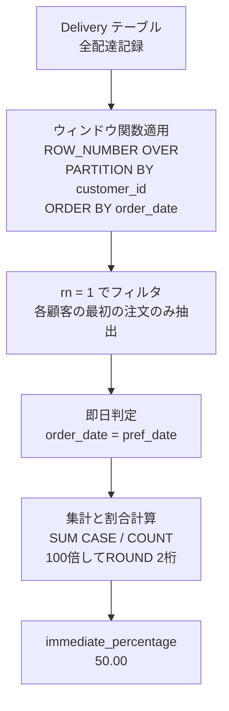

# PostgreSQL 16.6+

## 0) 前提

- エンジン: **PostgreSQL 16.6+**
- 並び順: 任意
- `NOT IN` 回避(`EXISTS` / `LEFT JOIN ... IS NULL` を推奨)
- 判定は ID 基準、表示は仕様どおり

## 1) 問題

- **各顧客の最初の注文(order_dateが最も早い注文)における「即日配達」の割合を求める**
    - 即日配達(immediate): `order_date = customer_pref_delivery_date`
    - 予約配達(scheduled): `order_date < customer_pref_delivery_date`
- 入力: `Delivery(delivery_id, customer_id, order_date, customer_pref_delivery_date)`
- 出力: `immediate_percentage` (小数点2桁、パーセンテージ表示)

## 2) 最適解(単一クエリ)

PostgreSQL では **CTE + ウィンドウ関数** で各顧客の最初の注文を特定し、集計で割合を算出。

Runtime 369 ms
Beats 73.30%

```sql
WITH first_orders AS (
  SELECT
    customer_id,
    order_date,
    customer_pref_delivery_date,
    ROW_NUMBER() OVER (
      PARTITION BY customer_id
      ORDER BY order_date
    ) AS rn
  FROM Delivery
)
SELECT
  ROUND(
    100.0 * SUM(CASE WHEN order_date = customer_pref_delivery_date THEN 1 ELSE 0 END)
    / COUNT(*),
    2
  ) AS immediate_percentage
FROM first_orders
WHERE rn = 1;
```

### 代替案(AVG + FILTER)

Runtime 373 ms
Beats 68.54%

```sql
WITH first_orders AS (
  SELECT
    customer_id,
    order_date = customer_pref_delivery_date AS is_immediate,
    ROW_NUMBER() OVER (
      PARTITION BY customer_id
      ORDER BY order_date
    ) AS rn
  FROM Delivery
)
SELECT
  ROUND(
    100.0 * AVG(is_immediate::int),
    2
  ) AS immediate_percentage
FROM first_orders
WHERE rn = 1;
```

### 代替案(DISTINCT ON - PostgreSQL特有)

Runtime 367 ms
Beats 76.31%

```sql
WITH first_orders AS (
  SELECT DISTINCT ON (customer_id)
    customer_id,
    order_date = customer_pref_delivery_date AS is_immediate
  FROM Delivery
  ORDER BY customer_id, order_date
)
SELECT
  ROUND(
    100.0 * COUNT(*) FILTER (WHERE is_immediate) / COUNT(*),
    2
  ) AS immediate_percentage
FROM first_orders;
```

## 3) 要点解説

- **`ROW_NUMBER() OVER (PARTITION BY customer_id ORDER BY order_date)`**: 各顧客ごとに注文を日付順に並べ、1番目を特定
- **`ROUND(100.0 * ... / ..., 2)`**: パーセンテージ計算時に `100.0` で浮動小数点除算を強制し、2桁で丸め
- **`DISTINCT ON`**: PostgreSQL特有の構文で、各グループの先頭行のみを効率的に取得可能
- **`COUNT(*) FILTER (WHERE ...)`**: PostgreSQL 9.4+の集計フィルタ構文で条件付きカウントを簡潔に記述

## 4) 計算量(概算)

- ウィンドウ処理: **O(n log n)** (全行をcustomer_id + order_dateでソート)
- 集計: **O(顧客数)** (最初の注文のみをスキャン)
- インデックス `(customer_id, order_date)` があれば **Index Scan** で効率化
- 全体: **O(n log n)** ~ **O(n)** (インデックス有り)

## 5) 図解(Mermaid 超保守版)



---

**補足**: 例のデータで検証すると、customer 1と3がscheduled、customer 2と4がimmediate → 2/4 = 50.00% となり正しく算出されます。
