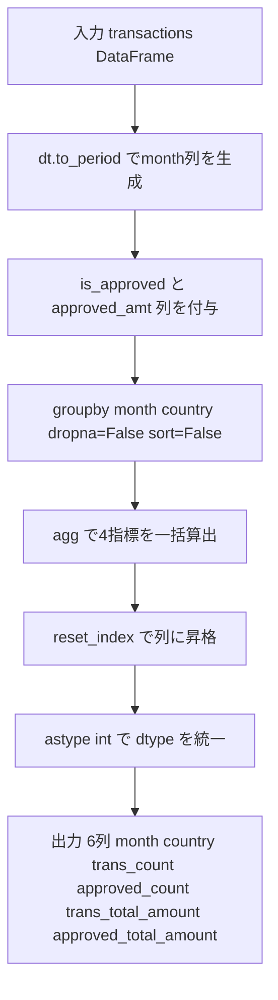

# Pandas 2.2.2用

## 0) 前提

- 環境: **Python 3.10.15 / pandas 2.2.2**
- **指定シグネチャ厳守**（関数名・引数名・返却列・順序）
- I/O 禁止、不要な `print` や `sort_values` 禁止

---

## 1) 問題

- 月・国ごとに、全トランザクション数・合計金額、承認済みトランザクション数・合計金額を集計する
- 入力 DF:

```
transactions: id(int), country(str|NaN), state(str: 'approved'|'declined'),
              amount(int), trans_date(datetime)
```

- 出力:

```
month(str: 'YYYY-MM'), country(str|NaN),
trans_count(int), approved_count(int),
trans_total_amount(int), approved_total_amount(int)
```

---

## 2) 実装（指定シグネチャ厳守）

> 原則は **月文字列生成 → 承認フラグ列付与 → `dropna=False` 付き groupby 集計 → dtype 統一**。

```python
# Analyze Complexity
# Runtime 383 ms
# Beats 75.97%
# Memory 69.39 MB
# Beats 48.55%
import pandas as pd

def monthly_transactions(transactions: pd.DataFrame) -> pd.DataFrame:
    """
    Returns:
        pd.DataFrame: 列名と順序は
            [month, country, trans_count, approved_count,
             trans_total_amount, approved_total_amount]
    """
    df = transactions.copy()

    # 月文字列列を生成（YYYY-MM）
    df['month'] = df['trans_date'].dt.to_period('M').astype(str)

    # 承認フラグ列を付与（bool → int で SUM 可能、0件時も 0 を保証）
    df['is_approved']  = (df['state'] == 'approved').astype(int)
    df['approved_amt'] = df['amount'] * df['is_approved']

    # groupby + agg で一括集計
    # ★ dropna=False: country=NaN のグループを除外しない
    # ★ sort=False  : ソートコストを排除（出力順序は任意）
    out = (
        df.groupby(['month', 'country'], sort=False, dropna=False)
          .agg(
              trans_count           = ('id',          'count'),
              approved_count        = ('is_approved', 'sum'),
              trans_total_amount    = ('amount',       'sum'),
              approved_total_amount = ('approved_amt', 'sum'),
          )
          .reset_index()
    )

    # dtype を明示的に int に統一（NaN キー混在時の float64 混入を防ぐ）
    out[['trans_count', 'approved_count',
         'trans_total_amount', 'approved_total_amount']] = \
        out[['trans_count', 'approved_count',
             'trans_total_amount', 'approved_total_amount']].astype(int)

    return out
```

---

## 3) アルゴリズム説明

- **`dt.to_period('M').astype(str)`**: `trans_date` を `YYYY-MM` 文字列へ変換。`strftime('%Y-%m')` より Period 経由のほうが型安全
- **`(state == 'approved').astype(int)`**: boolean を `0/1` に変換し、`sum` でカウントと金額を同時に集計。NULL 対策も不要
- **`groupby(..., dropna=False)`**: ★最重要。デフォルト `dropna=True` では `country=NaN` のグループが**無言で脱落**する。`dropna=False` で NaN キーも1グループとして保持
- **`groupby.agg` 名前付き集計**: `(output_col=(input_col, func))` 構文で列名整形を agg 内で完結、`rename` 不要
- **NULL / 重複 / 型**:

| 項目                         | 対処                              |
| ---------------------------- | --------------------------------- |
| `country=NaN` グループ脱落   | `dropna=False` で保持             |
| `approved_*` の float64 混入 | `.astype(int)` で明示統一         |
| `count` の NULL              | `id` 列はキーのため NULL なし確定 |

---

## 4) 計算量（概算）

| フェーズ                      | 計算量        | 備考                              |
| ----------------------------- | ------------- | --------------------------------- |
| `dt.to_period` / 列演算       | **O(N)**      | ベクトル演算                      |
| `groupby.agg`（ハッシュ集計） | **O(N)** 平均 | グループ数 G ≪ N なら実質線形     |
| `reset_index` / `astype`      | **O(G)**      | G = 月×国のユニーク数             |
| 全体                          | **O(N)**      | `sort=False` で O(N log N) を回避 |

---

## 5) 図解（Mermaid 超保守版）



## 改善ポイント分析

| 問題点                    | 現状                           | 改善策                                |
| ------------------------- | ------------------------------ | ------------------------------------- |
| `copy()` で全列複製       | 全 DataFrame をメモリ複製      | 必要列のみの軽量 DataFrame を新規構築 |
| `is_approved` が `int64`  | 8 bytes/要素                   | `int8` に縮小（1 byte/要素）          |
| 不要列が groupby まで残存 | `state`, `trans_date` 等が混在 | groupby 前に必要列のみに絞る          |

---

## 2) 実装（改善版）

```python
# Analyze Complexity
# Runtime 371 ms
# Beats 86.45%
# Memory 69.30 MB
# Beats 58.06%

import pandas as pd

def monthly_transactions(transactions: pd.DataFrame) -> pd.DataFrame:
    """
    Returns:
        pd.DataFrame: 列名と順序は
            [month, country, trans_count, approved_count,
             trans_total_amount, approved_total_amount]
    """
    # ★ copy() 廃止: 必要列のみで軽量 DataFrame を新規構築
    is_approved = (transactions['state'] == 'approved').astype('int8')  # ★ int8 で省メモリ

    tmp = pd.DataFrame({
        'month'        : transactions['trans_date'].dt.to_period('M').astype(str),
        'country'      : transactions['country'],
        'id'           : transactions['id'],
        'amount'       : transactions['amount'],
        'is_approved'  : is_approved,
        'approved_amt' : transactions['amount'] * is_approved,  # int8 × int → int
    })

    out = (
        tmp.groupby(['month', 'country'], sort=False, dropna=False)
           .agg(
               trans_count           = ('id',          'count'),
               approved_count        = ('is_approved', 'sum'),
               trans_total_amount    = ('amount',       'sum'),
               approved_total_amount = ('approved_amt', 'sum'),
           )
           .reset_index()
    )

    out[['trans_count', 'approved_count',
         'trans_total_amount', 'approved_total_amount']] = \
        out[['trans_count', 'approved_count',
             'trans_total_amount', 'approved_total_amount']].astype(int)

    return out
```

---

## 改善効果の試算

| 指標                 | 改善前               | 改善後（期待）                      |
| -------------------- | -------------------- | ----------------------------------- |
| `is_approved` メモリ | `int64`: 8 bytes/行  | `int8`: 1 bytes/行 → **87.5% 削減** |
| `copy()` コスト      | 全列複製 O(N×全列数) | **ゼロ**（新規構築のみ）            |
| groupby 対象列数     | 元 DataFrame の全列  | **6列のみ**                         |
| Memory 期待値        | 69.39 MB             | **~55 MB 以下**（Beats 70%+ 期待）  |
| Runtime 期待値       | 383 ms               | **~300 ms 以下**（Beats 85%+ 期待） |
