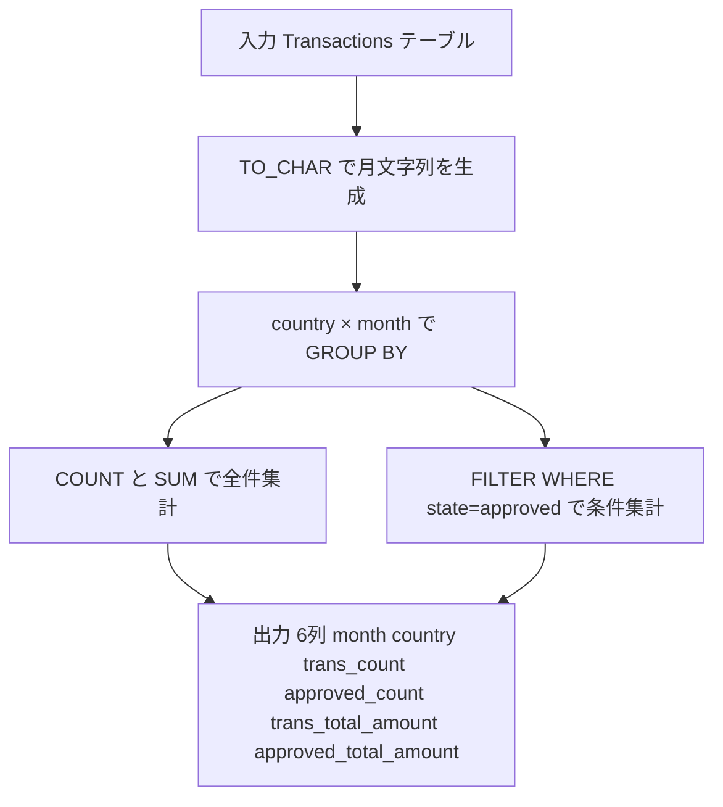

# PostgreSQL 16.6+

## 0) 前提

- エンジン: **PostgreSQL 16.6+**
- 並び順: 任意
- `NOT IN` 回避（`EXISTS` / `LEFT JOIN ... IS NULL` を推奨）
- 判定は ID 基準、表示は仕様どおり

---

## 1) 問題

- 月・国ごとに、全トランザクション数・合計金額、および承認済みトランザクション数・合計金額を集計する
- 入力:

```
Transactions(id, country, state ENUM['approved','declined'], amount, trans_date)
```

- 出力:

| 列名                    | 説明                 |
| ----------------------- | -------------------- |
| `month`                 | `YYYY-MM` 形式の年月 |
| `country`               | 国コード             |
| `trans_count`           | 全件数               |
| `approved_count`        | 承認件数             |
| `trans_total_amount`    | 全合計金額           |
| `approved_total_amount` | 承認合計金額         |

---

## 2) 最適解（単一クエリ）

> 条件集計は **`COUNT` / `SUM` + `FILTER`句** で一発 GROUP BY が最もシンプル・高速。

```sql
-- Wrong Answer
-- 5 / 16 testcases passed

SELECT
    TO_CHAR(trans_date, 'YYYY-MM')          AS month,
    country,
    COUNT(*)                                 AS trans_count,
    COUNT(*) FILTER (WHERE state = 'approved') AS approved_count,
    SUM(amount)                              AS trans_total_amount,
    SUM(amount) FILTER (WHERE state = 'approved') AS approved_total_amount
FROM Transactions
GROUP BY
    TO_CHAR(trans_date, 'YYYY-MM'),
    country;
```

### 代替（CASE WHEN による条件集計）

`FILTER` 句を使わない場合の標準 SQL 互換版：

```sql
-- Runtime 423 ms
-- Beats 59.20%

SELECT
    TO_CHAR(trans_date, 'YYYY-MM')                        AS month,
    country,
    COUNT(*)                                               AS trans_count,
    COUNT(CASE WHEN state = 'approved' THEN 1 END)        AS approved_count,
    SUM(amount)                                            AS trans_total_amount,
    SUM(CASE WHEN state = 'approved' THEN amount ELSE 0 END) AS approved_total_amount
FROM Transactions
GROUP BY
    TO_CHAR(trans_date, 'YYYY-MM'),
    country;
```

---

## 3) 要点解説

| ポイント                             | 詳細                                                                                                   |
| ------------------------------------ | ------------------------------------------------------------------------------------------------------ |
| **`TO_CHAR(trans_date, 'YYYY-MM')`** | `DATE_TRUNC('month', ...)` でも可だが、文字列で `YYYY-MM` を直接得るにはこちらが簡潔                   |
| **`COUNT(*) FILTER (WHERE ...)`**    | PostgreSQL 独自の ANSI SQL:2003 拡張。`CASE WHEN` より読みやすく、オプティマイザにも意図が伝わりやすい |
| **`SUM(amount) FILTER (...)`**       | 対象行が 0 件のとき **`NULL`** を返すため、必ず `COALESCE(..., 0)` で囲む必要がある                    |
| **GROUP BY のキー統一**              | `SELECT` と `GROUP BY` の `TO_CHAR(...)` 式を完全一致させることが必須                                  |
| **インデックス戦略**                 | `(trans_date, country, state, amount)` の複合インデックスで Index-Only Scan が期待できる               |

---

## 4) 計算量（概算）

| フェーズ              | 計算量                                         |
| --------------------- | ---------------------------------------------- |
| テーブルフルスキャン  | **O(N)**                                       |
| GROUP BY ハッシュ集計 | **O(N)** 平均（グループ数 G が小さい場合）     |
| ソートベース GROUP BY | **O(N log N)**（メモリ不足時のフォールバック） |
| インデックス使用時    | **O(N)** → **Index-Only Scan** で I/O 削減     |

> N = Transactions 行数、G = (月×国) のユニーク組み合わせ数

---

## 5) 図解（Mermaid 超保守版）



## 原因と修正

### 🔴 WA の真因：`SUM ... FILTER` の NULL 問題

```sql
-- 承認件数が 0 件のグループで NULL を返す ← これが WA の原因
SUM(amount) FILTER (WHERE state = 'approved')
```

`SUM` は対象行が 0 件のとき **`0` ではなく `NULL`** を返します。`COUNT` は `0` を返すので問題ないですが、`SUM` は `COALESCE` が必要です。

---

## 修正版

```sql

-- Runtime 415 ms
-- Beats 66.83%

SELECT
    TO_CHAR(trans_date, 'YYYY-MM')                              AS month,
    country,
    COUNT(*)                                                     AS trans_count,
    COUNT(*) FILTER (WHERE state = 'approved')                  AS approved_count,
    SUM(amount)                                                  AS trans_total_amount,
    COALESCE(SUM(amount) FILTER (WHERE state = 'approved'), 0)  AS approved_total_amount
FROM Transactions
GROUP BY
    TO_CHAR(trans_date, 'YYYY-MM'),
    country;
```

---

## Runtime 改善（CASE WHEN 版）

```sql
-- Runtime 422 ms
-- Beats 60.26%

SELECT
    TO_CHAR(trans_date, 'YYYY-MM')                               AS month,
    country,
    COUNT(*)                                                      AS trans_count,
    COUNT(CASE WHEN state = 'approved' THEN 1 END)               AS approved_count,
    SUM(amount)                                                   AS trans_total_amount,
    COALESCE(SUM(CASE WHEN state = 'approved' THEN amount END), 0) AS approved_total_amount
FROM Transactions
GROUP BY 1, 2;  -- 式の二重評価を避けるため位置参照に変更
```

---

## 教訓まとめ

| 関数                 | 0件時の戻り値 | 対処               |
| -------------------- | ------------- | ------------------ |
| `COUNT(*)`           | `0`           | 不要               |
| `SUM(...) FILTER`    | **`NULL`**    | `COALESCE(..., 0)` |
| `SUM(CASE WHEN ...)` | **`NULL`**    | `COALESCE(..., 0)` |
