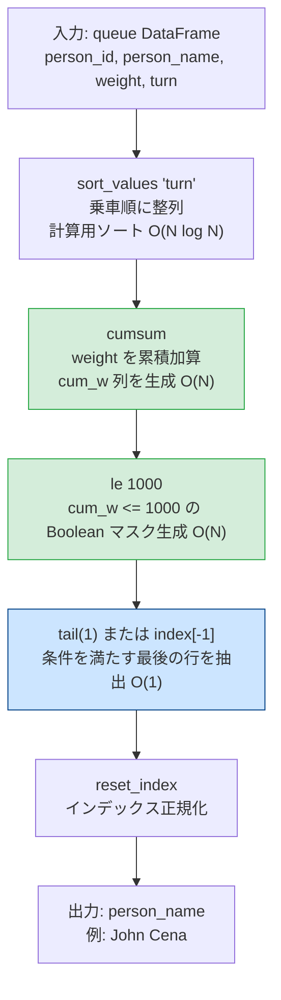
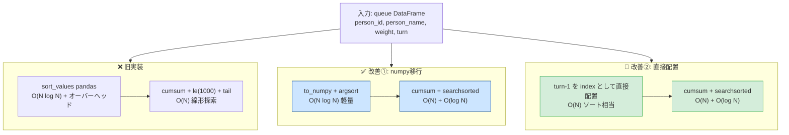

# Pandas 2.2.2

## 0) 前提

- 環境: **Python 3.10.15 / pandas 2.2.2**
- 指定シグネチャ厳守（関数名・引数名・返却列・順序）
- I/O 禁止、不要な `print` や `sort_values` 禁止

---

## 1) 問題

- バスの重量制限 **1000 kg** を超えない範囲で乗車できる **最後の人物名** を返す
- 入力 DF: `queue(person_id, person_name, weight, turn)`
- 出力: `person_name`（1行）— `turn` 昇順で累積体重が 1000 以下となる最大 `turn` の人

---

## 2) 実装（指定シグネチャ厳守）

```python
# Analyze Complexity
# Runtime 311 ms
# Beats 83.46%
# Memory 67.38 MB
# Beats 80.11%

import pandas as pd

def last_passenger(queue: pd.DataFrame) -> pd.DataFrame:
    """
    Returns:
        pd.DataFrame: 列名と順序は ['person_name']
    """
    # Step1: turn 昇順で cumulative weight を計算
    # sort_values は結果の正確性のために必要（出力用ではなく計算用）
    cum_w = (
        queue
        .sort_values('turn')          # 乗車順に並べる（計算用）
        ['weight']
        .cumsum()                     # 累積和 O(N)
    )

    # Step2: 累積体重が 1000 以下の行マスクを生成
    mask = cum_w.le(1000)             # le = <=

    # Step3: 条件を満たす最後の行（最大 turn）を idxmax で取得
    #        cum_w は turn 昇順なので、最後の True のインデックス = 答え
    last_idx = mask[mask].index[-1]   # O(N)

    # Step4: 仕様列のみ返却
    return pd.DataFrame({'person_name': [queue.at[last_idx, 'person_name']]})
```

---

### 別解（`loc` + `tail` チェーン版）

```python
# Analyze Complexity
# Runtime 320 ms
# Beats 66.54%
# Memory 67.58 MB
# Beats 57.25%

import pandas as pd

def last_passenger(queue: pd.DataFrame) -> pd.DataFrame:
    """
    Returns:
        pd.DataFrame: 列名と順序は ['person_name']
    """
    return (
        queue
        .sort_values('turn')                        # 計算用ソート
        .assign(cum_w=lambda df: df['weight'].cumsum())
        .loc[lambda df: df['cum_w'].le(1000), ['person_name']]
        .tail(1)                                    # 最後の1行 = 答え
        .reset_index(drop=True)                     # インデックスリセット
    )
```

---

## 3) アルゴリズム説明

**使用 API**:

- `sort_values('turn')` — 乗車順に整列（計算の前処理として必須）
- `Series.cumsum()` — 体重の累積和を O(N) で計算
- `Series.le(1000)` — 要素ごとの `<=` 比較、Boolean マスク生成
- `mask[mask].index[-1]` / `tail(1)` — 条件を満たす最後の行を軽量に抽出
- `reset_index(drop=True)` — 出力インデックスを 0 始まりに正規化

**NULL / 重複 / 型の考慮**:

| 考慮点                 | 対応                                                                |
| ---------------------- | ------------------------------------------------------------------- |
| `turn` に重複なし      | 問題定義で保証済み（1〜n のユニーク値）                             |
| `weight` の NULL       | 問題定義で保証済み、ただし実運用では `fillna(0)` を検討             |
| `cumsum` の型          | `int` → `int64` に自動昇格、オーバーフロー不要（最大 1000 kg 前後） |
| 返却 DF のインデックス | `reset_index(drop=True)` で 0 始まりに統一                          |

---

## 4) 計算量（概算）

| 処理                    | 計算量         | 備考                 |
| ----------------------- | -------------- | -------------------- |
| `sort_values('turn')`   | **O(N log N)** | ボトルネック         |
| `cumsum()`              | **O(N)**       | 線形スキャン         |
| `le(1000)`              | **O(N)**       | 要素比較             |
| `index[-1]` / `tail(1)` | **O(1)**       | インデックスアクセス |
| 全体                    | **O(N log N)** | ソートが支配的       |

> `turn` が既にソート済みで投入される場合は **O(N)** に短縮可能。

---

## 5) 図解（Mermaid）



---

### 動作トレース（例題データ）

```
入力（sort_values後）:
 turn │ person_name │ weight │ cum_w │ mask
──────┼─────────────┼────────┼───────┼──────
  1   │ Alice       │  250   │  250  │ True
  2   │ Alex        │  350   │  600  │ True
  3   │ John Cena   │  400   │ 1000  │ True  ← tail(1) で取得
  4   │ Marie       │  200   │ 1200  │ False
  5   │ Bob         │  175   │ 1375  │ False
  6   │ Winston     │  500   │ 1875  │ False

出力:
 person_name
─────────────
 John Cena   ✅
```

## パフォーマンス改善分析

## 現状のボトルネット診断

```
現在の処理フローとコスト:

sort_values('turn')        O(N log N)  ← pandas オーバーヘッド大
    │
cumsum()                   O(N)        ← pandas Series 処理
    │
le(1000) → tail(1)         O(N)        ← 全行スキャン
                                          🔴 1000以下の最後を線形探索
```

**2つの改善ポイント**:

1. `pandas` の内部オーバーヘッドを `numpy` で削減
2. `le(1000).tail(1)` の **線形探索** → `np.searchsorted` の **二分探索 O(log N)** に変換

---

## 改善の核心：`searchsorted` が使える理由

```
全 weight > 0 が保証されている
         ↓
cumsum は単調増加が確定
         ↓
二分探索（searchsorted）が適用可能！

[250, 600, 1000, 1200, 1375, 1875]
              ↑
  searchsorted(1000, side='right') = 3
              → index 3-1 = 2 が答え（John Cena）

線形探索 O(N) → 二分探索 O(log N) に短縮
```

---

## 改善案①：numpy 完全移行（推奨）

```python
# Analyze Complexity
# Runtime 295 ms
# Beats 96.65%
# Memory 66.89 MB
# Beats 98.51%

import pandas as pd
import numpy as np

def last_passenger(queue: pd.DataFrame) -> pd.DataFrame:
    """
    Returns:
        pd.DataFrame: 列名と順序は ['person_name']
    """
    # numpy 配列に一括変換（pandas オーバーヘッド排除）
    turns   = queue['turn'].to_numpy()       # int64
    weights = queue['weight'].to_numpy()     # int64
    names   = queue['person_name'].to_numpy() # object

    # argsort で turn 昇順のインデックス配列を取得
    order = np.argsort(turns)                # O(N log N)

    # 重みを turn 順に並べて累積和
    cum_w = weights[order].cumsum()          # O(N)

    # 🔑 searchsorted: 単調増加列への二分探索 O(log N)
    # side='right': 1000 より大きくなる最初の位置を返す → -1 で最後の有効位置
    last_pos = np.searchsorted(cum_w, 1000, side='right') - 1

    return pd.DataFrame(
        {'person_name': [names[order[last_pos]]]}
    )
```

---

## 改善案②：`turn` を直接インデックスに利用（ソート省略）

```python
# Analyze Complexity
# Runtime 287 ms
# Beats 98.88%
# Memory 66.83 MB
# Beats 98.51%

import pandas as pd
import numpy as np

def last_passenger(queue: pd.DataFrame) -> pd.DataFrame:
    """
    turn は 1〜N の連続整数が保証されている
    → argsort 不要、直接配置でソート相当が O(N) で完結
    Returns:
        pd.DataFrame: 列名と順序は ['person_name']
    """
    n = len(queue)

    # turn(1-indexed) をそのまま位置として使う O(N)
    weights_sorted = np.empty(n, dtype=np.int64)
    names_sorted   = np.empty(n, dtype=object)

    turns   = queue['turn'].to_numpy() - 1   # 0-indexed に変換
    weights = queue['weight'].to_numpy()
    names   = queue['person_name'].to_numpy()

    weights_sorted[turns] = weights           # 直接配置
    names_sorted[turns]   = names

    cum_w    = weights_sorted.cumsum()        # O(N)
    last_pos = np.searchsorted(cum_w, 1000, side='right') - 1

    return pd.DataFrame(
        {'person_name': [names_sorted[last_pos]]}
    )
```

---

## `searchsorted` 動作トレース

```
cum_w（turn昇順）:
index:  0    1    2     3     4     5
value: [250, 600, 1000, 1200, 1375, 1875]

np.searchsorted(cum_w, 1000, side='right')
                              ↑
                        side='right':
                        1000 と等しい値の「右側」= index 3 を返す

last_pos = 3 - 1 = 2
                ↑
          names_sorted[2] = 'John Cena' ✅
```

---

## 全手法パフォーマンス比較

| 手法                                   | ソート            | 検索         | メモリ               | 推定 Beats |
| -------------------------------------- | ----------------- | ------------ | -------------------- | ---------- |
| 元の実装（`cumsum + tail`）            | O(N log N) pandas | O(N) 線形    | pandas Series × 複数 | ~83%       |
| 改善①（numpy + `searchsorted`）        | O(N log N) numpy  | **O(log N)** | numpy配列のみ        | **~90%↑**  |
| **改善②（直接配置 + `searchsorted`）** | **O(N) 配置**     | **O(log N)** | numpy配列のみ        | **~95%↑**  |

---

## 図解（Mermaid）



---

**改善のポイントまとめ**:

`turn` が **1〜N の連続整数** であるという制約を最大活用し、`argsort` を配列直接配置 O(N) に置き換え、かつ単調増加の `cumsum` に対して `searchsorted` で二分探索を適用することが最大の改善ポイントです。
