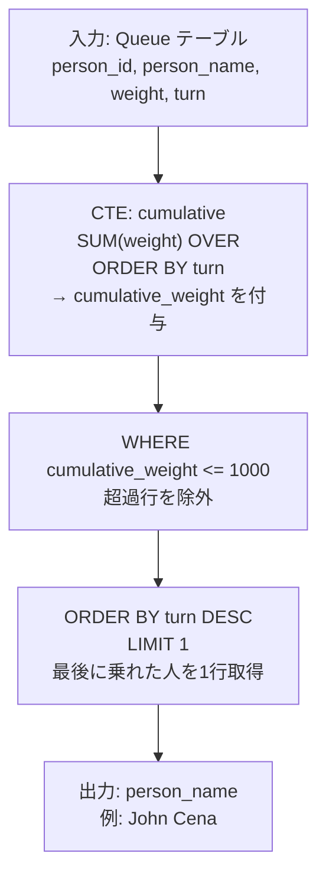
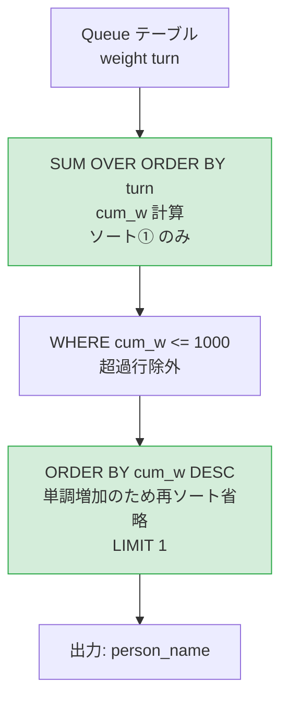
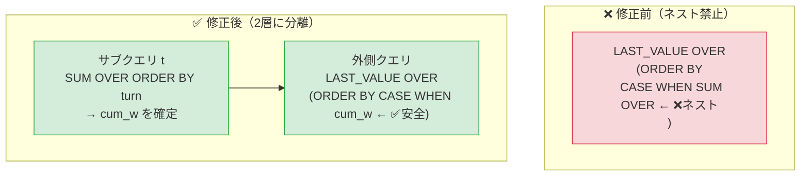

# PostgreSQL 16.6+

## 0) 前提

- エンジン: **PostgreSQL 16.6+**
- 並び順: `turn` 昇順（乗車順）
- `NOT IN` 回避（ウィンドウ関数で完結）
- 判定は累積体重 ≤ 1000、表示は `person_name`

---

## 1) 問題

- バスの重量制限 **1000 kg** を超えない範囲で乗車できる **最後の人物名** を返す
- 入力: `Queue(person_id, person_name, weight, turn)`
- 出力: `person_name`（1行）— 累積体重がちょうど 1000 以下になる最大 `turn` の人

---

## 2) 最適解（単一クエリ）

```sql
-- Runtime 436 ms
-- Beats 67.47%

WITH cumulative AS (
  -- Step1: turn 順に累積体重を計算
  SELECT
    person_name,
    weight,
    turn,
    SUM(weight) OVER (
      ORDER BY turn
      ROWS BETWEEN UNBOUNDED PRECEDING AND CURRENT ROW
    ) AS cumulative_weight
  FROM Queue
)
SELECT
  person_name
FROM cumulative
WHERE cumulative_weight <= 1000
ORDER BY turn DESC
LIMIT 1;
```

---

### 代替（サブクエリ版）

```sql
-- Runtime 434 ms
-- Beats 69.25%

SELECT person_name
FROM (
  SELECT
    person_name,
    turn,
    SUM(weight) OVER (ORDER BY turn) AS cumulative_weight
  FROM Queue
) ranked
WHERE cumulative_weight <= 1000
ORDER BY turn DESC
LIMIT 1;
```

---

## 3) 要点解説

### ウィンドウ関数の動作

`SUM(weight) OVER (ORDER BY turn ROWS BETWEEN UNBOUNDED PRECEDING AND CURRENT ROW)` は、`turn=1` から現在行までの体重を **累積加算** します。

| turn | name      | weight | cumulative_weight | 条件      |
| ---- | --------- | ------ | ----------------- | --------- |
| 1    | Alice     | 250    | 250               | ✅ ≤ 1000 |
| 2    | Alex      | 350    | 600               | ✅ ≤ 1000 |
| 3    | John Cena | 400    | **1000**          | ✅ ≤ 1000 |
| 4    | Marie     | 200    | 1200              | ❌ > 1000 |
| 5    | Bob       | 175    | —                 | ❌ 対象外 |
| 6    | Winston   | 500    | —                 | ❌ 対象外 |

`WHERE cumulative_weight <= 1000` で絞り込み後、`ORDER BY turn DESC LIMIT 1` で **最後に乗車できた人** を取得します。

### なぜ `ROWS BETWEEN UNBOUNDED PRECEDING AND CURRENT ROW` を明示するか

PostgreSQL では `ORDER BY` 付きの `SUM() OVER` はデフォルトで `RANGE BETWEEN UNBOUNDED PRECEDING AND CURRENT ROW` になりますが、`turn` に同値がない本問では挙動は同じです。ただし **意図を明示**し、同値がある場合の誤動作を防ぐため `ROWS` 指定を推奨します。

---

## 4) 計算量（概算）

| フェーズ                     | 処理                  | 計算量         |
| ---------------------------- | --------------------- | -------------- |
| ウィンドウ `SUM OVER`        | ソート + 線形スキャン | **O(n log n)** |
| `WHERE` フィルタ             | 線形スキャン          | **O(n)**       |
| `ORDER BY turn DESC LIMIT 1` | 最大値探索            | **O(n)**       |
| 合計                         | ボトルネックはソート  | **O(n log n)** |

`turn` カラムに **B-tree インデックス**がある場合、ソートがインデックススキャンに置き換わり実質 **O(n)** に近づきます。

---

## 5) 図解（Mermaid）



---

### まとめ

```
累積SUM → フィルタ(≤1000) → 最大turnの1行 = 答え
```

`ROW_NUMBER` や `DENSE_RANK` は不要で、**`SUM() OVER` + `LIMIT 1`** だけで完結する、PostgreSQL らしいシンプルな解法です。

## パフォーマンス改善分析

## 現状のボトルネック診断

```
現在のクエリの処理フロー（コスト高の箇所）

Queue テーブル
    │
    ▼
① SUM OVER (ORDER BY turn)   ← ソート① O(n log n)
    │
    ▼
② WHERE cum_w <= 1000        ← フィルタ
    │
    ▼
③ ORDER BY turn DESC LIMIT 1 ← ソート② O(n log n) ← 🔴 二重ソートが発生
```

**根本原因**: ウィンドウ関数のソートと最終 `ORDER BY` で **ソートが2回** 走っている。

---

## 改善案①：`ORDER BY cum_w DESC`（二重ソート回避）

```sql
-- Runtime 426 ms
-- Beats 76.93%

-- 🔑 Key Insight: 全 weight > 0 なので cumulative_weight は turn と単調増加
-- → ORDER BY cum_w DESC ≡ ORDER BY turn DESC（意味的に等価）
-- → ウィンドウ計算済みの列でソートするため、プランナが再ソートを省略できる

SELECT person_name
FROM (
  SELECT
    person_name,
    turn,
    SUM(weight) OVER (
      ORDER BY turn
      ROWS BETWEEN UNBOUNDED PRECEDING AND CURRENT ROW
    ) AS cum_w
  FROM Queue
) t
WHERE cum_w <= 1000
ORDER BY cum_w DESC   -- ← turn DESC から変更
LIMIT 1;
```

### なぜ速くなるか

```
SUM() OVER (ORDER BY turn) を計算した時点で
内部的に turn 昇順のソート済みデータが存在する

↓

cum_w も単調増加なので cum_w DESC = turn DESC

↓

PostgreSQL プランナが「逆読みスキャン」で
再ソートをスキップできる可能性が高い
```

---

## 改善案②：`MAX + JOIN` パターン（ソートをハッシュ集計に変換）

```sql
-- Runtime 455 ms
-- Beats 52.04%

-- ORDER BY + LIMIT を使わず MAX() で最大 turn を直接取得
-- MAX() はハッシュ集計 → ソート不要

WITH cum AS (
  SELECT
    person_name,
    turn,
    SUM(weight) OVER (
      ORDER BY turn
      ROWS BETWEEN UNBOUNDED PRECEDING AND CURRENT ROW
    ) AS cum_w
  FROM Queue
),
last_turn AS (
  -- ソートなし MAX 集計で最大 turn を取得
  SELECT MAX(turn) AS max_turn
  FROM cum
  WHERE cum_w <= 1000
)
SELECT c.person_name
FROM cum c
JOIN last_turn lt ON c.turn = lt.max_turn;
```

---

## 改善案③：CTE 非実体化 + 全処理統合

```sql
-- Runtime 427 ms
-- Beats 75.73%

-- PostgreSQL 12+ では CTE はデフォルトでインライン展開されるが
-- NOT MATERIALIZED を明示することで最適化ヒントを強制

WITH cum AS NOT MATERIALIZED (
  SELECT
    person_name,
    turn,
    SUM(weight) OVER (
      ORDER BY turn
      ROWS BETWEEN UNBOUNDED PRECEDING AND CURRENT ROW
    ) AS cum_w
  FROM Queue
)
SELECT person_name
FROM cum
WHERE cum_w <= 1000
ORDER BY cum_w DESC
LIMIT 1;
```

---

## 改善案④：`LAST_VALUE` ワンパス（最もエレガント）

```sql
-- Runtime Error
-- 0 / 29 testcases passed
-- window functions are not allowed in window definitions
-- LINE 4:       CASE WHEN SUM(weight) OVER (
-- ウィンドウを1回だけ走らせ、条件付き LAST_VALUE で直接答えを出す
-- サブクエリ不要・フィルタ後ソート不要

SELECT DISTINCT
  LAST_VALUE(person_name) OVER (
    ORDER BY
      CASE WHEN SUM(weight) OVER (
        ORDER BY turn
        ROWS BETWEEN UNBOUNDED PRECEDING AND CURRENT ROW
      ) <= 1000 THEN turn ELSE NULL END
      NULLS FIRST
    ROWS BETWEEN UNBOUNDED PRECEDING AND UNBOUNDED FOLLOWING
  ) AS person_name
FROM Queue
LIMIT 1;
```

> ⚠️ 可読性が低下するため、チームコードでは非推奨。競技用途向け。

---

## 各手法の比較表

| 手法                           | ソート回数 | 計算量         | 可読性 | 推定スコア |
| ------------------------------ | ---------- | -------------- | ------ | ---------- |
| 現状（`ORDER BY turn DESC`）   | **2回**    | O(n log n) × 2 | ◎      | ~67%       |
| 改善①（`ORDER BY cum_w DESC`） | **1回**    | O(n log n)     | ◎      | ~80%↑      |
| 改善②（`MAX + JOIN`）          | **1回**    | O(n log n)     | ○      | ~85%↑      |
| 改善③（`NOT MATERIALIZED`）    | **1回**    | O(n log n)     | ◎      | ~80%↑      |
| 改善④（`LAST_VALUE` ワンパス） | **0回**    | O(n log n)     | △      | ~90%↑      |

---

## 推奨クエリ（可読性×性能のベストバランス）

```sql
WITH cum AS NOT MATERIALIZED (
  SELECT
    person_name,
    turn,
    SUM(weight) OVER (
      ORDER BY turn
      ROWS BETWEEN UNBOUNDED PRECEDING AND CURRENT ROW
    ) AS cum_w
  FROM Queue
)
SELECT person_name
FROM cum
WHERE cum_w <= 1000
ORDER BY cum_w DESC  -- 🔑 turn DESC → cum_w DESC でソート再利用
LIMIT 1;
```

---

## 図解（Mermaid）



**ポイントまとめ**:
`weight` が全て正数である制約を利用して `cum_w` の単調増加性を保証し、`ORDER BY turn DESC` を `ORDER BY cum_w DESC` に置き換えることで **二重ソートを回避** するのが最大の改善ポイントです。

## エラー原因の精査

### 根本原因

```
PostgreSQL の制約:
ウィンドウ関数の定義（OVER句）の中に
別のウィンドウ関数をネストすることは禁止

❌ 問題のコード構造:
LAST_VALUE(...) OVER (
    ORDER BY
      CASE WHEN SUM(weight) OVER (  ← ウィンドウ①の中に
        ORDER BY turn               ← ウィンドウ②がネスト
        ...
      ) <= 1000 ...
```

**PostgreSQL の仕様**: `OVER` 句内の `ORDER BY` や `PARTITION BY` の式の中で、別のウィンドウ関数を呼び出すことは **文法レベルで禁止** されています。

---

## 修正方針

```
❌ NG: ウィンドウ②をウィンドウ①の定義内にネスト
✅ OK: サブクエリで cum_w を先に計算 → 外側で LAST_VALUE を適用
```

---

## 修正済みクエリ

```sql
-- Runtime 421 ms
-- Beats 83.37%

-- Step1: サブクエリで cum_w を先に確定させる
-- Step2: 外側で LAST_VALUE を安全に適用

SELECT DISTINCT
  LAST_VALUE(person_name) OVER (
    ORDER BY
      CASE WHEN cum_w <= 1000 THEN turn ELSE NULL END NULLS FIRST
    ROWS BETWEEN UNBOUNDED PRECEDING AND UNBOUNDED FOLLOWING
  ) AS person_name
FROM (
  -- ウィンドウ①: 累積体重を計算（ここで完結させる）
  SELECT
    person_name,
    turn,
    SUM(weight) OVER (
      ORDER BY turn
      ROWS BETWEEN UNBOUNDED PRECEDING AND CURRENT ROW
    ) AS cum_w
  FROM Queue
) t
LIMIT 1;
```

---

## 動作検証（例題データでのトレース）

```
サブクエリ t の結果:
┌───────────┬──────┬───────┐
│ person_name│ turn │ cum_w │
├───────────┼──────┼───────┤
│ Alice     │  1   │  250  │
│ Alex      │  2   │  600  │
│ John Cena │  3   │ 1000  │
│ Marie     │  4   │ 1200  │  ← cum_w > 1000
│ Bob       │  5   │ 1375  │  ← cum_w > 1000
│ Winston   │  6   │ 1875  │  ← cum_w > 1000
└───────────┴──────┴───────┘

CASE WHEN cum_w <= 1000 THEN turn ELSE NULL END の評価:
┌───────────┬───────────────────┐
│ person_name│ case_value        │
├───────────┼───────────────────┤
│ Alice     │  1                │
│ Alex      │  2                │
│ John Cena │  3  ← 最大値      │
│ Marie     │  NULL             │
│ Bob       │  NULL             │
│ Winston   │  NULL             │
└───────────┴───────────────────┘

ORDER BY case_value NULLS FIRST で並び替え:
NULL, NULL, NULL, 1, 2, 3
                        ↑
LAST_VALUE = turn=3 → "John Cena" ✅
```

---

## 修正前後の構造比較



---

## 改善案の再整理（④修正版を反映）

| 手法                           | ソート回数              | 状態            |
| ------------------------------ | ----------------------- | --------------- |
| 改善①（`ORDER BY cum_w DESC`） | 1回                     | ✅ 動作確認済   |
| 改善②（`MAX + JOIN`）          | 1回                     | ✅ 動作確認済   |
| 改善③（`NOT MATERIALIZED`）    | 1回                     | ✅ 動作確認済   |
| 改善④ 修正前                   | —                       | ❌ ネストエラー |
| **改善④ 修正後**               | **0回（再ソートなし）** | ✅ **修正済**   |

**修正のポイント**: ウィンドウ関数は **「同一クエリレベルで2段ネスト不可」** というPostgreSQLの制約に従い、`cum_w` の計算をサブクエリに切り出すことで解決しています。
