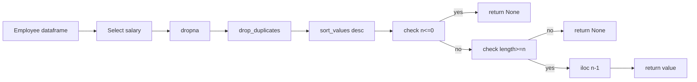

# pandas を使って **n 番目に高い “重複なし” 給与**を求める関数と、手順の図解（Mermaid）

## ✅ 方針（pandas）

1. `salary` 列を取り出す
2. `dropna()`（任意）で欠損除去
3. `drop_duplicates()` で **Distinct**
4. `sort_values(ascending=False)` で **降順**
5. `n<=0` なら **None**、件数不足でも **None**
6. 十分ならインデックス `n-1` を返す

---

## 🧩 実装（関数）

```python
import pandas as pd
from typing import Optional

def get_nth_highest_salary(df: pd.DataFrame, n: int) -> Optional[int]:
    """
    Return the nth highest DISTINCT salary from Employee dataframe.
    If n <= 0 or distinct count < n, return None.

    Parameters
    ----------
    df : pd.DataFrame
        Must contain a column named 'salary' (int).
    n : int
        1-based rank.

    Returns
    -------
    Optional[int]
        nth highest distinct salary or None.
    """
    if n <= 0:
        return None

    distinct_desc = (
        df['salary']
        .dropna()
        .drop_duplicates()
        .sort_values(ascending=False)
    )

    if len(distinct_desc) < n:
        return None

    # pandas では int(np.integer) になる可能性があるので int() で標準intへ
    return int(distinct_desc.iloc[n - 1])
```

### ワンライナー版（例外を出さずに None へフォールバック）

```python
def get_nth_highest_salary_one_liner(df: pd.DataFrame, n: int) -> Optional[int]:
    if n <= 0:
        return None
    s = df['salary'].dropna().drop_duplicates().sort_values(ascending=False)
    return int(s.iloc[n - 1]) if len(s) >= n else None
```

---

## 🧪 サンプルテスト

```python
# Example 1
df1 = pd.DataFrame({"id":[1,2,3], "salary":[100,200,300]})
print(get_nth_highest_salary(df1, 2))  # 200

# Example 2 (不足)
df2 = pd.DataFrame({"id":[1], "salary":[100]})
print(get_nth_highest_salary(df2, 2))  # None

# 追加: n<=0 は None
print(get_nth_highest_salary(df1, -1))  # None

# 追加: 重複があってもDistinctで処理
df3 = pd.DataFrame({"id":[1,2,3,4], "salary":[100,200,200,300]})
print(get_nth_highest_salary(df3, 2))  # 200
```

---

## 📈 計算量

- N = レコード数, D = distinct 給与数
- `drop_duplicates()` が O(N)、`sort_values()`（D 件のソート）が **O(D log D)**
- トータルは **O(N + D log D)**（通常はソートが支配的）

---

## 🧭 代替実装（`nlargest` を使う）

`unique()` → `Series` 化 → `nlargest(n)` → `iloc[-1]`。
※ 件数不足チェックは必要。

```python
import pandas as pd

def get_nth_highest_salary_v2(df: pd.DataFrame, n: int) -> Optional[int]:
    if n <= 0:
        return None
    uniq = pd.Series(df['salary'].dropna().unique())
    if len(uniq) < n:
        return None
    return int(uniq.nlargest(n).iloc[-1])
```

---

## 🗺️ 図解（Mermaid）

### 図 1: 全体フロー



### 図 2: Example1 n=2


### 図 3: Example2 n=2 insufficient


### 図 4: n<=0


---

必要なら、**Polars 版**や **SQL→pandas 変換パターン**も作れます。テスト用の DataFrame をこちらで生成して結果を表形式で出すことも可能です。

LeetCode の「関数を返す形式」に合わせて、**`pd.DataFrame` を返す関数**に整えます。
仕様は「Employee テーブルを pandas DataFrame として受け取り、
N 番目に高い distinct salary を `getNthHighestSalary(N)` というカラム名の DataFrame として返す」です。

---

## ✅ 実装

```python
import pandas as pd
from typing import Optional

def nth_highest_salary(employee: pd.DataFrame, N: int) -> pd.DataFrame:
    """
    Return the Nth highest distinct salary as a DataFrame with column name
    'getNthHighestSalary(N)'. If there are fewer than N distinct salaries or N <= 0,
    return a DataFrame with None.

    Parameters
    ----------
    employee : pd.DataFrame
        DataFrame with at least a 'salary' column.
    N : int
        1-based rank of salary to retrieve.

    Returns
    -------
    pd.DataFrame
        Single-row DataFrame with one column named 'getNthHighestSalary(N)'.
    """
    colname = f"getNthHighestSalary({N})"

    if N <= 0:
        return pd.DataFrame({colname: [None]})

    distinct_desc = (
        employee["salary"]
        .dropna()
        .drop_duplicates()
        .sort_values(ascending=False)
        .reset_index(drop=True)
    )

    if len(distinct_desc) < N:
        return pd.DataFrame({colname: [None]})
    else:
        return pd.DataFrame({colname: [int(distinct_desc.iloc[N - 1])]})


# ===== サンプル動作確認 =====
if __name__ == "__main__":
    df1 = pd.DataFrame({"id": [1, 2, 3], "salary": [100, 200, 300]})
    print(nth_highest_salary(df1, 2))
    # 期待: 200

    df2 = pd.DataFrame({"id": [1], "salary": [100]})
    print(nth_highest_salary(df2, 2))
    # 期待: None

    df3 = pd.DataFrame({"id": [1, 2, 3, 4], "salary": [100, 200, 200, 300]})
    print(nth_highest_salary(df3, 2))
    # 期待: 200
```

---

## 🧪 実行例

```text
>>> df1
   id  salary
0   1     100
1   2     200
2   3     300

>>> nth_highest_salary(df1, 2)
   getNthHighestSalary(2)
0                    200

>>> nth_highest_salary(df1, 5)
   getNthHighestSalary(5)
0                    None

>>> nth_highest_salary(df1, -1)
   getNthHighestSalary(-1)
0                     None
```

---

これで **LeetCode の PostgreSQL/MySQL 版と同じ入出力フォーマット**が pandas で再現できます。
