```mermaid
flowchart LR
  A["words.txt<br/>入力ファイル"] --> B["<code>tr -s &#91;:space:&#93; \\n</code><br/>全ての空白→改行 / 連続は1つに圧縮"]
  B --> C["<code>sort</code><br/>辞書順整列"]
  C --> D["<code>uniq -c</code><br/>連続同一語をカウント"]
  D --> E["<code>sort -nr</code><br/>頻度で降順"]
  E --> F["<code>awk {print $2, $1}</code><br/>出力整形（単語 頻度）"]
  F --> G["結果"]
```

# 解答（スクリプト版）

`wordfreq.sh`（Bash, POSIX ツールのみ）

```bash
#!/usr/bin/env bash
set -euo pipefail

# 使い方: ./wordfreq.sh [path/to/words.txt]
# 引数が未指定なら ./words.txt を読む
input="${1:-words.txt}"

# 1) 全ての空白(スペース/タブ/改行など)を改行にし、連続空白は1つに圧縮
# 2) ソート
# 3) uniq -c で頻度集計
# 4) 頻度(第1列)で数値降順ソート
# 5) "単語 頻度" の並びに整形
LC_ALL=C tr -s '[:space:]' '\n' < "$input" \
  | sort \
  | uniq -c \
  | sort -nr \
  | awk '{print $2, $1}'
```

実行権限を付与して実行:

```bash
chmod +x wordfreq.sh
./wordfreq.sh                 # カレントの words.txt を集計
# もしくは
./wordfreq.sh /path/to/words.txt
```

---

## 解答（パイプのみの 1 行）

```bash
LC_ALL=C tr -s '[:space:]' '\n' < words.txt | sort | uniq -c | sort -nr | awk '{print $2, $1}'
```

---

## 出力例

`words.txt` が次の内容のとき:

```text
the day is sunny the the
the sunny is is
```

どちらの方法でも:

```text
the 4
is 3
sunny 2
day 1
```

---

## 図解：処理の流れ

```mermaid
flowchart LR
  A[words.txt<br/>入力ファイル] --> B["tr -s &apos;&#91;:space:&#93;&apos; &apos;\\n&apos;<br/>全ての空白→改行 / 連続を1つに圧縮"]
  B --> C["sort<br/>単語を辞書順に並べる"]
  C --> D["uniq -c<br/>連続する同一単語をカウント"]
  D --> E["sort -nr<br/>頻度(数値)で降順ソート"]
  E --> F["awk '{print $2, $1}'<br/>「単語 頻度」に整形"]
  F --> G[結果]
```



---

## ステップ別のミニ実演（変換のイメージ）

入力:

```text
the day is sunny the the
the sunny is is
```

1. **tr -s '[:space:]' '\n'**
   全ての空白を改行に（重複空白は圧縮）:

```text
the
day
is
sunny
the
the
the
sunny
is
is
```

## 2. **sort**（辞書順）

```text
day
is
is
is
sunny
sunny
the
the
the
the
```

## 3. **uniq -c**（連続同一語を数える）

```text
      1 day
      3 is
      2 sunny
      4 the
```

## 4. **sort -nr**（頻度降順）

```text
      4 the
      3 is
      2 sunny
      1 day
```

## 5. **awk '{print $2, $1}'**（「単語 頻度」に整形）

```text
the 4
is 3
sunny 2
day 1
```

---

## なぜこの順番？

- `uniq -c` は**連続**した同一行しか数えられないため、まず `sort` で同じ単語を隣接させます。
- `tr -s '[:space:]' '\n'` を先に使うことで、スペース・タブ・改行など**あらゆる空白**を 1 語 1 行に正規化できます。
- 最終的に `sort -nr` で頻度を**数値降順**にし、`awk` で「単語 頻度」に整えます。

---

## 代替ワンライナー（awk メイン）

`awk` でカウントしてから、頻度で降順ソートする方法もあります。
（大量データ時のパイプ構成はお好みで）

```bash
awk '{for(i=1;i<=NF;i++) c[$i]++} END{for(w in c) print w, c[w]}' words.txt \
  | LC_ALL=C sort -k2,2nr
```

- `NF` は行内のフィールド数（空白区切り）
- 連想配列 `c[word]` にカウント
- END で「単語 頻度」を出力し、`sort -k2,2nr` で第 2 列（頻度）を降順ソート

---

## 小さな TIPS

- **ロケール固定**: `LC_ALL=C` を付けると `sort` が速く・安定します。
- **空行ケア**: `tr -s` を使っていれば空行は基本的に出ませんが、念のためはさむなら
  `... | grep -v '^$' | ...` を `sort` の前に入れても OK です。
- **入力ファイル指定**: スクリプト版は引数でファイルを差し替え可能にしています。

必要なら、`zcat ... | tr ... | ...` のように圧縮ファイルやストリームにも簡単に応用できます。

## 修正点

原因は、**ノードラベル内に Mermaid の構文と衝突する文字（`[ ] ' \ :` など）が“そのまま”入っている**ためです。
あなたの行には `B[tr -s '[:space:]' '\n'<br/> ...]` とありますが、
ラベル中の `[` と `]`（`[:space:]` の部分）が **ノードの区切り `[...]`** と誤解され、
さらに直後のシングルクォート `'` でパーサがこけています（`got 'SQS'` は Single Quote String を示唆）。

## 修正方針（どれか or 併用）1

1. **ラベルを二重引用符で囲む**：`id[" ... "]`
2. **ラベル内の角かっこ `[` `]` を HTML エンティティに置換**：`&#91;` と `&#93;`
3. **必要に応じてクォートやバックスラッシュをエスケープ/置換**：`'` → `&apos;`、`\n` → `\\n` など
4. **長いコマンドはコード風に**（バッククォート）**や改行 `<br/>` を併用**

---

## 直した例（あなたのフローをそのまま修正）


### ポイント 1

- `B[...]` を `B["..."]` に変更（**二重引用符**でラベル全体を囲む）
- `[:space:]` の角かっこを **`&#91;` と `&#93;`** に置換
- シングルクォート `'` は **`&apos;`** に（中でさらに `'` を使いたいときの衝突回避）
- `\n` は **`\\n`** に（バックスラッシュをエスケープ）
- `<br/>` はそのままで OK（HTML ラベルは許容されます）

---

## もう少し読みやすくする代替（コマンド部分をコード表記）1

```mermaid
flowchart LR
  A[words.txt<br/>入力ファイル] --> B["`tr -s &#91;:space:&#93; \\n`<br/>全ての空白→改行 / 連続は1つに圧縮"]
  B --> C["`sort`<br/>辞書順整列"]
  C --> D["`uniq -c`<br/>連続同一語をカウント"]
  D --> E["`sort -nr`<br/>頻度で降順"]
  E --> F["`awk '{print $2, $1}'`<br/>出力整形（単語 頻度）"]
  F --> G[結果]
```

> バッククォート `` `...` `` で**コード風**に包むと、特殊文字の衝突が起きにくく、可読性も上がります。

---

## 安全な書き方テンプレ 1

- ラベルが記号を含むときは **常に `id["..."]`** を使う
- 角かっこは **`&#91;` `&#93;`** に
- シングルクォートは **`&apos;`**、ダブルクォートは **`&quot;`**
- バックスラッシュは **`\\`**
- 改行は **`<br/>`** を使う（Mermaid は HTML ラベル可）

この要領で直すと、パースエラーは解消されます。

原因は、**ノードラベル内に Mermaid の構文と衝突する文字（`[ ] ' \ :` など）が“そのまま”入っている**ためです。
あなたの行には `B[tr -s '[:space:]' '\n'<br/> ...]` とありますが、
ラベル中の `[` と `]`（`[:space:]` の部分）が **ノードの区切り `[...]`** と誤解され、
さらに直後のシングルクォート `'` でパーサがこけています（`got 'SQS'` は Single Quote String を示唆）。

## 修正方針（どれか or 併用）2

1. **ラベルを二重引用符で囲む**：`id[" ... "]`
2. **ラベル内の角かっこ `[` `]` を HTML エンティティに置換**：`&#91;` と `&#93;`
3. **必要に応じてクォートやバックスラッシュをエスケープ/置換**：`'` → `&apos;`、`\n` → `\\n` など
4. **長いコマンドはコード風に**（バッククォート）**や改行 `<br/>` を併用**

---

## 直した例（あなたのフローをそのまま修正）2


### ポイント 2

- `B[...]` を `B["..."]` に変更（**二重引用符**でラベル全体を囲む）
- `[:space:]` の角かっこを **`&#91;` と `&#93;`** に置換
- シングルクォート `'` は **`&apos;`** に（中でさらに `'` を使いたいときの衝突回避）
- `\n` は **`\\n`** に（バックスラッシュをエスケープ）
- `<br/>` はそのままで OK（HTML ラベルは許容されます）

---

## もう少し読みやすくする代替（コマンド部分をコード表記）2

```mermaid
flowchart LR
  A[words.txt<br/>入力ファイル] --> B["`tr -s &#91;:space:&#93; \\n`<br/>全ての空白→改行 / 連続は1つに圧縮"]
  B --> C["`sort`<br/>辞書順整列"]
  C --> D["`uniq -c`<br/>連続同一語をカウント"]
  D --> E["`sort -nr`<br/>頻度で降順"]
  E --> F["`awk '{print $2, $1}'`<br/>出力整形（単語 頻度）"]
  F --> G[結果]
```

> バッククォート `` `...` `` で**コード風**に包むと、特殊文字の衝突が起きにくく、可読性も上がります。

---

## 安全な書き方テンプレ 2

- ラベルが記号を含むときは **常に `id["..."]`** を使う
- 角かっこは **`&#91;` `&#93;`** に
- シングルクォートは **`&apos;`**、ダブルクォートは **`&quot;`**
- バックスラッシュは **`\\`**
- 改行は **`<br/>`** を使う（Mermaid は HTML ラベル可）

この要領で直すと、パースエラーは解消されます。

発生原因はまだ**ソースにスマート置換で混入した非 ASCII 文字**（合字やスマート引用符など）が残っていること＋**Mermaid のラベル内での特殊記号衝突**です。
安全策として「完全 ASCII・最小限の記号・HTML エンティティで角かっこを逃がす・バッククォート不使用」の版に差し替えてください。下のどれかを**そのままコピペ**で動きます。

---

## 安全版その 1（ASCII のみ・角かっこを HTML エンティティ化・バッククォート不使用）

```mermaid
flowchart LR
  A["words.txt<br/>入力ファイル"] --> B["tr -s &#91;:space:&#93; \\n<br/>全ての空白→改行 / 連続は1つに圧縮"]
  B --> C["sort<br/>辞書順整列"]
  C --> D["uniq -c<br/>連続同一語をカウント"]
  D --> E["sort -nr<br/>頻度で降順"]
  E --> F["awk &#123;print $2, $1&#125;<br/>出力整形（単語 頻度）"]
  F --> G["結果"]
```



ポイント

- `[:space:]` の角かっこは `&#91;` と `&#93;`
- 改行リテラルは `\\n`
- `awk '{print $2, $1}'` は衝突回避のため **波かっこをエンティティ化**（`&#123;` `&#125;`）し、**シングルクォートを排除**しました（見た目の違いだけで意味説明には十分）

---

## 安全版その 2（コマンドを `<code>` で表示・記号衝突をさらに回避）



> `<code>...</code>` を使うとバッククォート不要で、Markdown/レンダラーによる再変換の影響を受けにくくなります。

---

## それでも直らない場合のチェックリスト

1. **貼り付けは必ずプレーンテキスト**で
    - ブラウザやエディタの「Paste and Match Style / Paste as plain text」を使う

2. **エディタ設定**（例：VS Code）
    - `"editor.fontLigatures": false`（合字を無効）
    - Markdown 拡張の **スマート引用符/全角置換を無効** に

3. **ファイルエンコード**：UTF-8（BOM なし推奨）
4. **問題記号の回避**
    - 角かっこは `&#91;` `&#93;`
    - バックスラッシュは必ず `\\` と二重
    - シングル/ダブルクォートは極力使わないか、必要なら `&apos;` / `&quot;`

このどちらかの安全版を使えば、`Lexical error on line 2. Unrecognized text.` は解消されるはずです。
